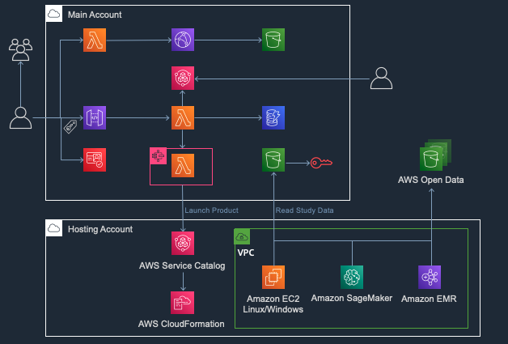

# Service Workbench on AWS

## Overview

Service Workbench on AWS is a cloud solution that enables IT teams to provide secure, repeatable, and federated control of access to data, tooling, and compute power that researchers need. With Service Workbench, researchers no longer have to worry about navigating cloud infrastructure. They can focus on
achieving research missions and completing essential work in minutes, not months, in configured research environments.

With Service Workbench on AWS, researchers can quickly and securely stand up research environments and conduct experiments with peers from other institutions. By automating the creation of baseline research setups, simplifying data access, and providing price transparency, researchers and IT departments save time, which they can reinvest in following cloud best practices and achieving research
reproducibility.

## Region Expansion

It's a repo for region expansion of [Service Workbench on AWS][swb] solution.
It mainly provides below additional features,

- Support additional regions
    - AWS China(Ningxia) Region operated by NWCD
    - AWS China(Beijing) Region operated by Sinnet
    - Asia Pacific (Hong Kong)
- Configurable IdPs, support both Amazon Cognito and external OIDC providers(for example, Keycloak, Okta), see [RFC](./rfcs/configurable_idp/index.md)
- Use [AWS Systems Manager Session Manager][ssm-session-manager] to access Linux instances, see [RFC](./rfcs/ssm_to_access_linux_template/index.md)
- Multiple languages(English/Chinese) support in Service Workbench console

## Service Workbench architecture

Service Workbench integrates existing AWS services, such as [Amazon CloudFront](https://docs.aws.amazon.com/AmazonCloudFront/latest/DeveloperGuide/Introduction.html), [AWS Lambda](https://docs.aws.amazon.com/lambda/latest/dg/welcome.html), and [AWS Step Functions](https://docs.aws.amazon.com/lambda/latest/dg/lambda-stepfunctions.html). Service Workbench enables you to create your own custom templates and share those templates with other organizations. To provide cost transparency, Service Workbench has been integrated with [AWS Cost Explorer](https://docs.aws.amazon.com/awsaccountbilling/latest/aboutv2/ce-getting-started.html), [AWS Budgets](https://docs.aws.amazon.com/awsaccountbilling/latest/aboutv2/budgets-managing-costs.html), and [AWS Organizations](https://docs.aws.amazon.com/awsaccountbilling/latest/aboutv2/consolidated-billing.html).

There are three types of Studies available in Service Workbench: My Studies, Organizational Studies and Open Data. Once you have created a Study you can upload files to it. Organizational Studies can be shared with other members in the organization. Owners of a study can amend the permissions of the study to grant access to other users. Once you have found the study or studies in which you are interested to perform research, you can deploy a workspace to attach the data to and conduct your research. 

### Main account

This is the account where Service Workbench infrastructure is deployed.

### Hosting account

This is the account where compute resources are deployed.

## Service Workbench components

Service Workbench contains the following components.You can find these components under the <service_workbench>/main/solution folder.

**Infrastructure**: The following AWS resources are created as part of this component deployment:
+ S3 bucket is used for logging the following actions:
     + Study data uploads
     + Accessing CloudFormation templates bucket
     + Accessing Cloudfront distribution service
     + To host the static Service Workbench website.
+ Cloudfront distribution service to accelerate Service Workbench website access based on user location.
**Backend**: Once the environment has been deployed, the backend component creates and configures the following AWS resources:
 + S3 bucket: 
     + To store uploaded study data. This bucket also receives an encryption key from AWS Key Management Service for encrypting this data and making it available to the Service Workbench website.
     + To store bootstrap scripts. These scripts will be used to launch the workspace instances like SageMaker, EC2, EMR.
     + This component also sets up some IAM roles and policies for accessing lambda functions and invoking step functions.
     + DynamoDB: This database will be used to store information concerning user authentication, AWS accounts, workflows, access tokens, study data etc. 
 This component is also responsible for deploying the following lambda functions/services:
     + Authentication layer handler - Handles the authentication layer for API handlers.
	+ Open data scrape handler - Handles scraping the metadata from the AWS open data registry.
     + API handler - Provides a path for public and protected APIs.
     + Workflow loop runner - Invoked by AWS step functions.
**Edge Lambda**: An inline Javascript interceptor function that adds security headers to the Cloudfront output response. This function is declared inline because the code requires API Gateway URL for the backend APIs.
**Machine images**: Deploys spot instances using machine images for EC2 and EMR templates.
**Prepare master accounts**: Creates a master IAM role for organization access.
**Post Deployment**: Creates an IAM role for the post deployment function with policies granting permission to S3 buckets, DynamoDB tables, KMS encryption key, Cloudfront and lambda functions.
**User Interface**: Contains code used to create and support the UI functionality of the application.

The solution also includes a Continuous Integration/Continuous Delivery feature:
+ main/cicd/cicd-pipeline
+ main/cicd/cicd-source

## Installing Service Workbench

Please refer [Service Workbench Document](https://awslabs.github.io/service-workbench-on-aws-cn/installation_guide/overview) to deploy and use Service Workbench.

---

## Recommended Reading

- [Serverless Framework for AWS](https://serverless.com/framework/docs/providers/aws/)
- [Serverless Stack](https://serverless-stack.com/)
- [Configure Multiple AWS Profiles](https://serverless-stack.com/chapters/configure-multiple-aws-profiles.html)
- [Serverless Offline](https://github.com/dherault/serverless-offline)
- [Github documentation](https://git-scm.com/docs)

## License

This project is licensed under the terms of the Apache 2.0 license. See [LICENSE](LICENSE).
Included AWS Lambda functions are licensed under the MIT-0 license. See [LICENSE-LAMBDA](LICENSE-LAMBDA).

[swb]: https://github.com/awslabs/service-workbench-on-aws
[ssm-session-manager]: https://docs.aws.amazon.com/systems-manager/latest/userguide/session-manager.html
