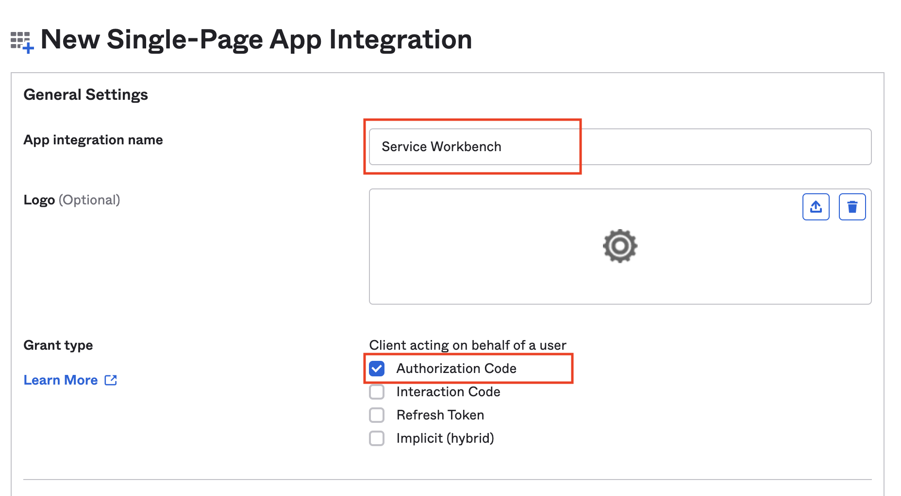
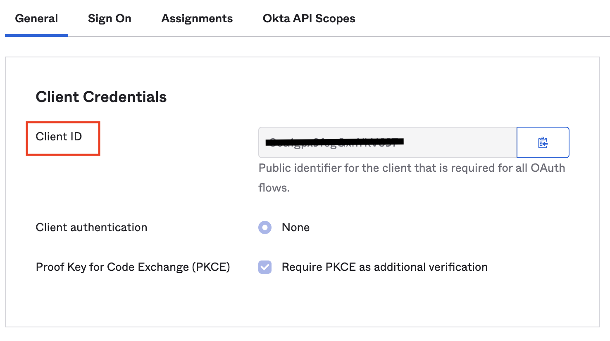

import useBaseUrl from '@docusaurus/useBaseUrl';

This section is for creating OIDC IdP client and creating Service Workbench root user in OIDC IdP.

## Creating OIDC IdP Client

OpenID Connect (OIDC) IdP is an alternative of [Cognito User Pool][cognito] for authentication of Service Workbench. Before deploying Service Workbench with OIDC IdP, you have to create your OIDC provider in external OIDC services.

Below are example procedures for creating OIDC providers in Authing, Keycloak and Okta for reference. You can use other OIDC providers as well.

- (Authing Option) [Authing][authing] is an example of a third-party authentication provider. 
- (Keycloak on AWS Option) [Keycloak on AWS][keycloak-solution] is a solution maintained by AWS and can serve as an authentication identity provider.
- (Okta Option) [Okta][okta] is one trusted platform to secure every identity, from customers to your workforce.

Follow the steps below to create an OIDC client, and obtain the `client_id` and `issuer`. 

### (Authing Option) Authing.cn OIDC client

1. Go to the [Authing console](https://console.authing.cn/console).
2. Create a user pool if you don't have one.
3. Select the user pool.
4. On the left navigation bar, select **Self-built App** under **Applications**. 
5. Click the **Create** button.
6. Enter the **Application Name**, and **Subdomain**.
7. Save the `App ID` (that is, `client_id`) and `Issuer` to a text file from Endpoint Information, which will be used later.
    

8. Update the `Login Callback URL` and `Logout Callback URL` to your IPC recorded domain name.
   For example: suppose our Service Workbench domain is `www.swb-example.com`, please input `https://www.swb-example.com/` for both `Login Callback URL` and `Logout Callback URL`.
    

   If we don't use custom domain for Service Workbench, the Service Workbench provide cloudfront domain to access. So we need to config deployed Service Workbench cloudfront domain to `Login Callback URL` and `Logout Callback URL`, before deploying Service Workbench, we can keep `Login Callback URL` and `Logout Callback URL` as `*`. After Service Workbench is deployed, we need to get cloudfront domain and enter it into `Login Callback URL` and `Logout Callback URL` again.
   
   
   * Get cloudfront domain
   **CloudFormation**, **Stacks**, **xxx-infrastructure**, **Outputs**, **WebsiteUrl**, like below:
   
    

9. Set the Authorization Configuration.
    

You have successfully created an authing self-built application. 
For more information, please visit [authing doc](https://docs.authing.cn/v2/en/)

### (Keycloak on AWS Option) Keycloak OIDC client

1. Deploy the Keycloak solution in AWS China Regions following [this guide](https://aws-samples.github.io/keycloak-on-aws/en/).

2. Make sure you can log in to the Keycloak console.

3. On the left navigation bar, select **Add realm**. Skip this step if you already have a realm. 

4. Go to the realm setting page. Choose **Endpoints**, and then **OpenID Endpoint Configuration** from the list.

    

5. In the JSON file that opens up in your browser, record the **issuer** value which will be used later.

    

6. Go back to Keycloak console and select **Clients** on the left navigation bar, and choose **Create**.
7. Enter a Client ID, which must contain 24 letters (case-insensitive) or numbers. Record the **Client ID** which will be used later.
8. Change client settings. Enter `https://<Service Workbench Console Domain>/` in `Valid Redirect URIs` and `Web Origins`, as shown below.

    

   If we don't use custom domain for Service Workbench, the Service Workbench provide cloudfront domain to access. So we need to config deployed Service Workbench cloudfront domain to `Valid Redirect URIs` and `Web Origins`, before deploying Service Workbench, we can keep `Valid Redirect URIs` and `Web Origins` as `*`. After Service Workbench is deployed, we need to get cloudfront domain and enter it into `Valid Redirect URIs` and `Web Origins` again.
   
   * Get cloudfront domain
   **CloudFormation**, **Stacks**, **xxx-infrastructure**, **Outputs**, **WebsiteUrl**, like below:
   

The issuer value is `https://<KEYCLOAK_DOMAIN_NAME>/auth/realms/<REALM_NAME>`. 

### (Okta Option) Okta OIDC client

1. Go to the [Okta console](https://www.okta.com/).
2. Create an account if you don't have one.
3. Access Admin console.
3. Create an application if you don't have one, choose **Applications**, **Application**, **Create App Integration**, **Create App Integration**, **OIDC - OpenID Connect** and **Single-Page Application**, click **Next** button. 
5. Click the **Create** button.
6. Enter the **App integration name**, set **Grant type** as **Authorization Code**.
    
7. Update the `Sign-in redirect URIs` and `Sign-out redirect URIs` to your IPC recorded domain name.
For example: suppose our Service Workbench domain is `www.swb-example.com`, please input `https://www.swb-example.com/` for both `Sign-in redirect URIs` and `Sign-out redirect URIs`.
    

   If we don't use custom domain for Service Workbench, the Service Workbench provide cloudfront domain to access. So we need to config deployed Service Workbench cloudfront domain to `Sign-in redirect URIs` and `Sign-out redirect URIs`, before deploying Service Workbench, we can keep `Sign-in redirect URIs` and `Sign-out redirect URIs` as `*`. After Service Workbench is deployed, we need to get cloudfront domain and enter it into `Sign-in redirect URIs` and `Sign-out redirect URIs` again.
   
   * Get cloudfront domain
   **CloudFormation**, **Stacks**, **xxx-infrastructure**, **Outputs**, **WebsiteUrl**, like below:
   

8. After creating application, you can get the `Client ID` (that is, `client_id`) text and the `Issuer` which is your Okta URL. Please save them which will be used later.
    

## Creating Service Workbench root user in OIDC IdP

Before deploying Service Workbench, you need to create a user in your OIDC IdP if you don't have one, this user will be used as Service Workbench root user.
Follow the steps below to create a user and obtain the `user_name`, `first_name` and `last_name`. 

### Creating user in Authing.cn

1. Login the [Authing console](https://console.authing.cn/console).
2. Choose **Users & Roles**, **Users**, **Create User** and **Email**, input `Email` and `Password`, click **Confirm** to create user.

    
3. Edit **Personal Info**, confirm `Email`, `Given Name` and `Family Name` have been fulled.

    

You have successfully created an user in authing. 

### Creating user in Keycloak

1. Login your deployed Keycloak Administration Console and choose the **realm** that you created before.

2. Choose **User** and **Add user**, input `Username`, `Email`, `First Name` and `Last Name`, then click **Save** to create user.
    

3. After user created, choose **Credentials** to set password.
   

You have successfully created an user in keycloak. 

### Creating user in Okta

1. Login the [Okta console](https://www.okta.com/) Admin console.
2. Choose **Directory**, **People** and **Add person**, then input `First name`, `Last name`, `Username` and `Primary email`, choose `I will set password` to set password, then click **Save**.
    

You have successfully created an user in Okta.

[cognito]: https://docs.aws.amazon.com/cognito/latest/developerguide/cognito-user-identity-pools.html
[openid-connect]: https://openid.net/connect/
[authing]: https://www.authing.cn/
[okta]: https://www.okta.com/sg/
[keycloak]: https://www.keycloak.org/
[auth0]: https://auth0.com/
[dg]: https://docs.aws.amazon.com/opensearch-service/latest/developerguide/createupdatedomains.html
[vpc]:https://docs.aws.amazon.com/opensearch-service/latest/developerguide/vpc.html
[icp]: https://www.amazonaws.cn/en/support/icp/?nc2=h_l2_su
[keycloak-solution]: https://www.amazonaws.cn/en/solutions/keycloak-on-aws/
