本安装手册将向您介绍如何在AWS全球区域安装Service Workbench解决方案。请确保您已经阅读和准备了所有的前提条件，并按照本手册中的说明逐步操作。

## 前提条件

- 准备AWS全球区域账户，本手册将以 **us-east-1** 区域为例

- 确保账户在安装区域至少还可以创建一个VPC

- 启用AWS成本管理器，请参考[AWS 账户准备](/zh/installation_guide/installation/pre-installation/tool-req) 
  :::tip

  本步骤会影响Service Workbench 仪表板显示功能，可以部署完成之后再进行配置。

  :::  

## Step 1：准备部署Service Workbench的工作环境

Service Workbench是一个开源的解决方案，通过shell脚本进行安装，您需要为此准备一个工作环境，将 Github 上的 Service Workbench 源代码下载到此工作环境，并在此工作环境上安装一些所需的软件。请在**us-east-1**区域创建EC2 instance工作环境，步骤如下：

  - 启动一个EC2 Instance: 进入[us-east-1 AWS EC2 Console](https://us-east-1.console.aws.amazon.com/ec2/home?region=us-east-1#LaunchInstances:) 启动一个Linux EC2 Instance，推荐参数如下：
    - 操作系统: **Amazon Linux**
    - AMI: **Amazon Linux 2 AMI (HVM) - Kernel 5.10, SSD Volume Type**
    - Instance类型: **t3.large**
      [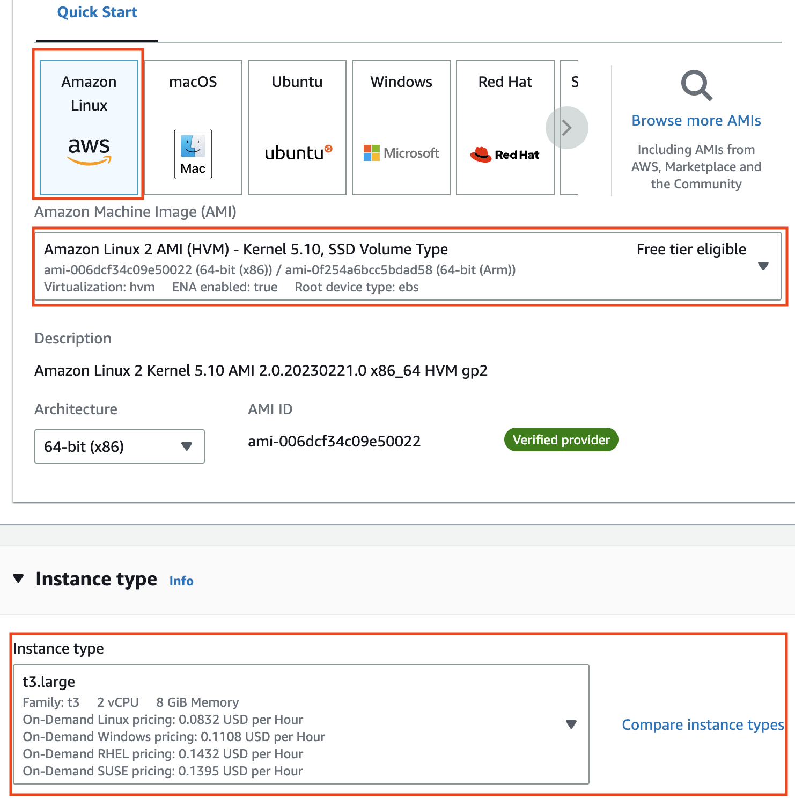](img/start_ec2_1.png)
    - EBS size: 建议40 GB
      [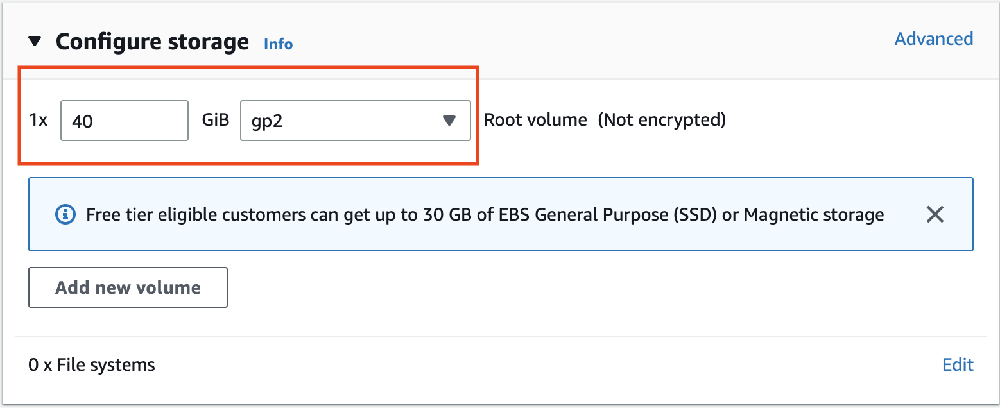](img/start_ec2_2.png)
  - 创建一个IAM role: 进入[us-east-1 IAM Console](https://us-east-1.console.aws.amazon.com/iamv2/home?region=us-east-1#/roles/create?step=selectEntities)创建IAM role。
    - 在**Trusted entity type** 选项，选择 **AWS service**。
    - 在**Use case** 选项，选择 **EC2**，然后点击**Next**按钮。
      [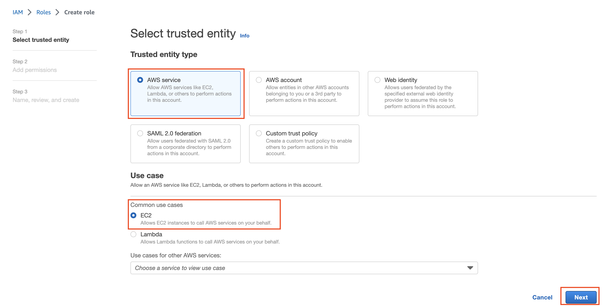](img/create_iam_role_1.png)
    - 授权**AdministratorAccess** 权限，然后点击**Next**按钮
      [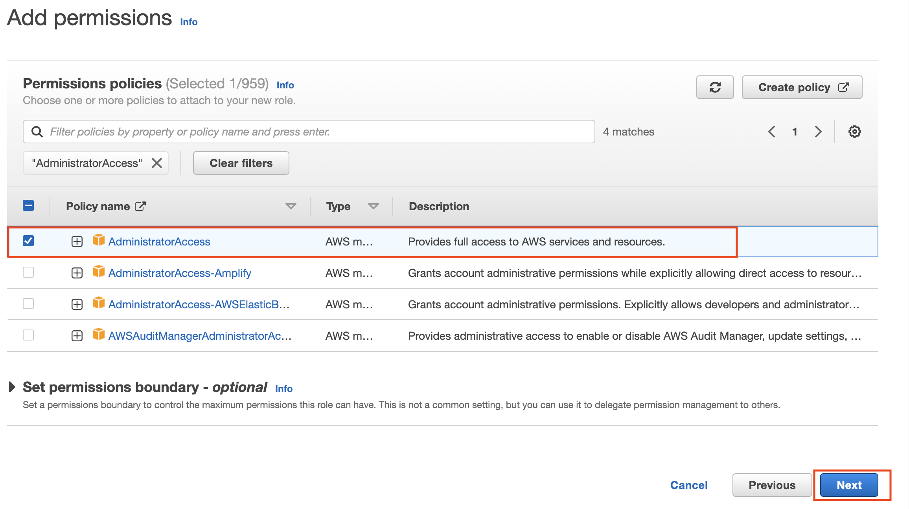](img/create_iam_role_2.png)
    - 输入**Role name**和**Description**，然后点击**Create role**按钮。
  - 将创建的role附加到ec2 instance
    - 进入[ec2 console](https://us-east-1.console.aws.amazon.com/ec2/home?region=us-east-1#Instances:)，选择ec2 instance，进入到**Modify IAM role**界面
      [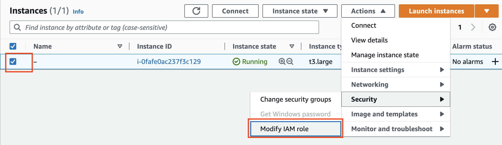](img/attach_role_1.png)
    - 选择上面步骤创建的role，点击**Update IAM role**按钮
      [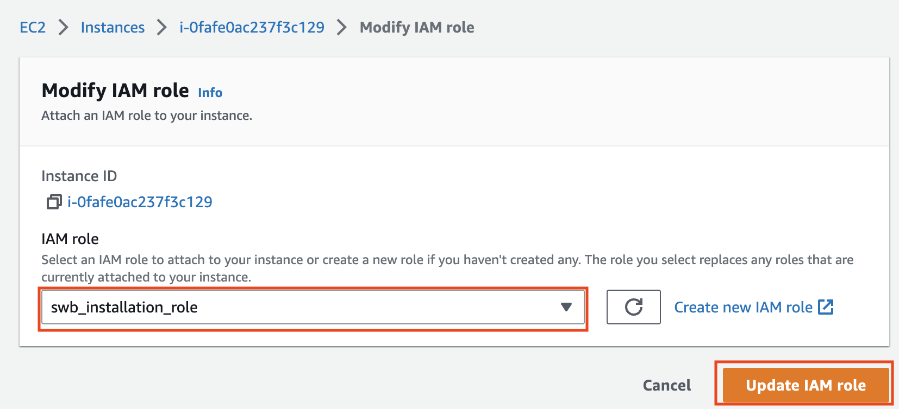](img/attach_role_2.png)
  - 使用 **ec2-user** SSH 到 EC2 Instance工作环境，详细步骤请参考[ec2 connect](https://docs.aws.amazon.com/AWSEC2/latest/UserGuide/AccessingInstancesLinux.html) 文档。
    [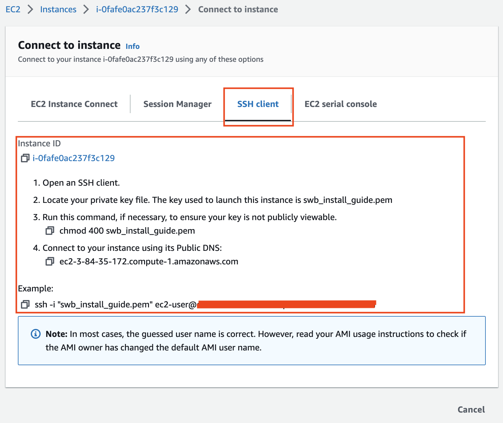](img/ssh_connect.png)
  - 在ec2 instance 中安装部署Service Workbench所需要的软件：
      - 安装nvm:
      ```
      curl -o- https://raw.githubusercontent.com/nvm-sh/nvm/v0.35.3/install.sh | bash
      source ~/.bashrc

      ```

      - 安装nodejs，pnpm，serverless 和 hygen
      ```
      nvm install 14
      npm install -g pnpm@5.18.9
      npm install -g serverless hygen

      ```

      - 安装 golang
      ```
      sudo yum install -y golang

      ```

      - 安装git
      ```
      sudo yum install -y git

      ```   

      - 验证软件是否安装成功，执行下面命令，如果所有软件的版本信息都输出到console，表示安装成功。
      ```
      node --version
      pnpm --version
      serverless -v
      go version
      git version

      ```

## Step 2：部署 Service Workbench
使用 **ec2-user** SSH 到 EC2 Instance 工作环境，按下列步骤执行：
  - 获取 Service Workbench 源码
  ```
  cd ~
  git clone https://github.com/awslabs/service-workbench-on-aws-cn.git

  ```   

  - 准备Stage Name环境变量:

    Stage name 用于允许来自同一帐户的多个 Service Workbench 部署, 它代表配置文件的名称。您可以选择自己的stage name, 但是不得超过五个字符。例如我们将Stage name定义为 **dev**
  
    ```
    echo 'export STAGE_NAME=dev' >> ~/.bashrc
    source ~/.bashrc

    ```

  - 为 **us-east-1** 区域准备Stage配置文件：
    ```
    cd ~/service-workbench-on-aws-cn/main/config/settings
    cp example-us-east-1.yml ${STAGE_NAME}.yml
    ```

    - 编辑 ${STAGE_NAME}.yml 文件，设定下列配置项：
        1. **awsRegion**: us-east-1      #设置您需要部署的region
        2. **rootUserEmail**: root@example.com    #设置您的root用户的email地址
        3. **rootUserFirstName**: root  #设置您的root用户的名字
        4. **rootUserLastName**: root  #设置您的root用户的姓

  - 执行下面命令开始Service Workbench的部署

      ```
      cd ~/service-workbench-on-aws-cn 
      ./scripts/environment-deploy.sh ${STAGE_NAME}
      
      ```

      部署大概15 ~ 20分钟，如果出现下面的输出，代码Service Workbench部署完成，请保存**Website URL**和**Temporary Native Pool Password**，后续需要使用。
      [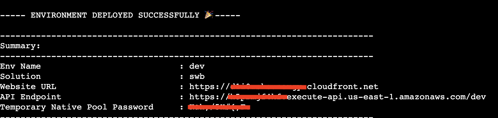](img/swb-deploy-success.png)

      部署完成后访问`Website URL` 域名，如果出现下面登录页面则代表部署成功：
      [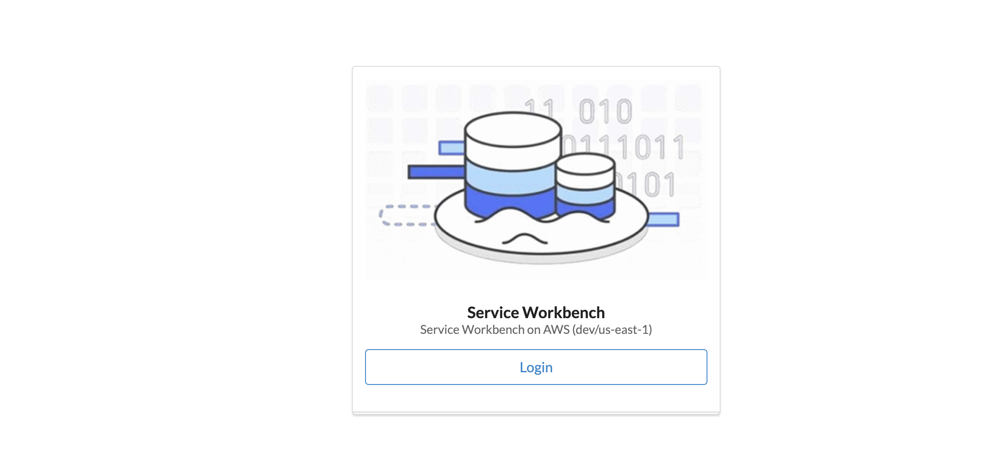](img/swb-login-page_1.png)

## Step 3：使用 Service Workbench
- 使用`rootUserEmail`登录Service Workbench，初始密码为**Temporary Native Pool Password**对应的值，根据提示设定自己的密码。

- 添加一个 AWS 账户，参考[添加一个AWS 账户](/zh/user_guide/sidebar/admin/accounts/aws_accounts/invite_member_account)

- 创建一个索引，参考[创建一个索引](/zh/user_guide/sidebar/admin/accounts/indexes/create_new_index)

- 创建一个项目，参考[创建一个项目](/zh/user_guide/sidebar/admin/accounts/projects/create_project)

- 添加Root用户到项目，参考[添加用户到项目](/zh/user_guide/sidebar/admin/accounts/projects/add_user_to_project)

- 导入内置workspace type, 参考[导入 AWS Service Catalog 产品](/zh/post_deployment/import_service_catalog_products/)

- 创建一个数据集和上传数据，参考[Studies](/zh/user_guide/sidebar/common/studies/introduction)

- 添加一个Researcher 用户，参考[添加一个用户](/zh/user_guide/sidebar/admin/users/add_federate_user.md) 

- 编辑已经创建的Study，选择**权限**, 授予 Researcher 读写权限，参考[更改组织数据集的权限](/zh/user_guide/sidebar/common/studies/studies_page#更改组织数据集的权限)

- 登出 root user, 使用上面创建的 Researcher 用户登录。

  **注意**：如果Researcher用户首次登陆Service Workbench，需要Researcher用户在cognito user pool中注册，输入Researcher用户的相关信息。如下图所示：
    1. 访问Service Workbench首页，点击**Login**按钮：
      [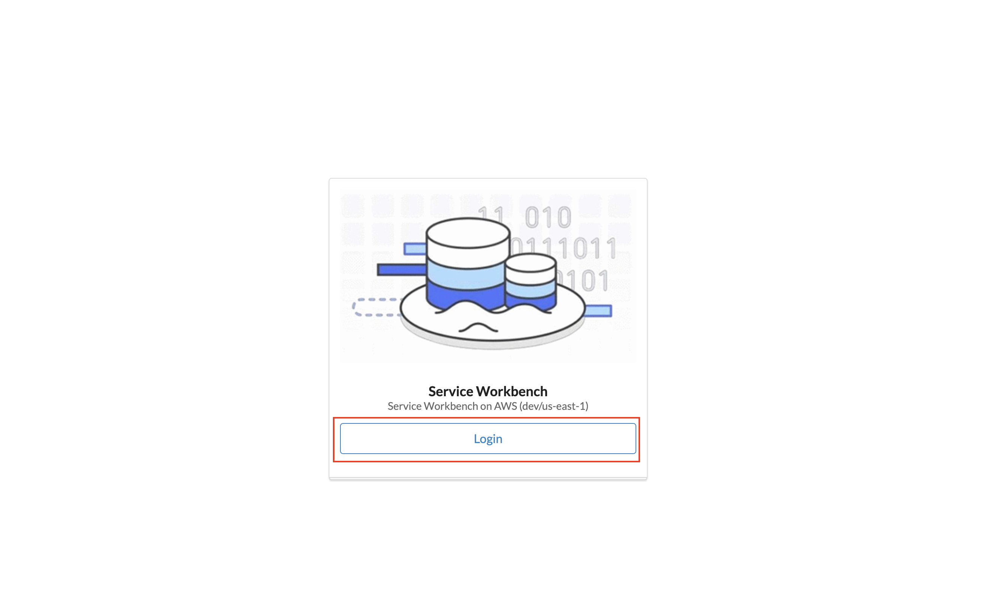](img/swb_login_page.png)
    2. 点击**Sign up**按钮进入cognito user pool用户注册页面。
      [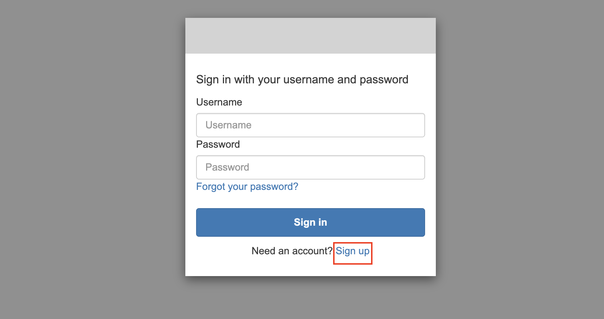](img/user_sign_up.png)
    3. 根据提示输入Researcher用户的相关信息，其中**Username**必须与管理员在service workbench中添加用户时填入的**Username**保持一致，输入完成后点击**Sign up**按钮。
      [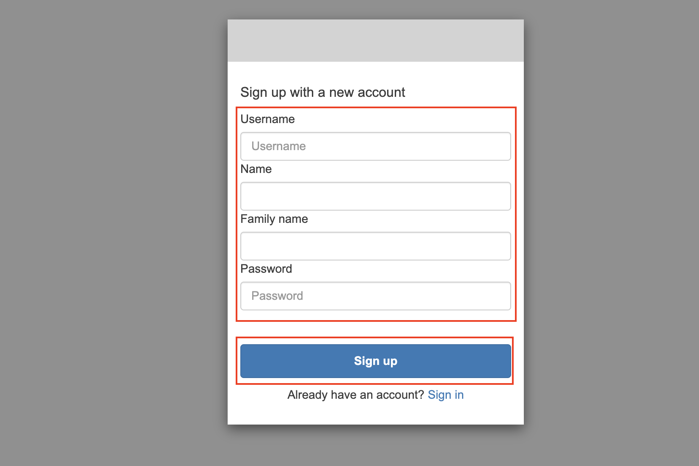](img/input_user_info.png)

- 选择一个数据集和已经导入的workspace type, 创建workspace，创建成功后数据集会自动mount到workspace中。参考[创建工作区](/zh/user_guide/sidebar/common/workspaces/create_workspace_study)

- 访问 workspace, 参考 [访问工作区](/zh/user_guide/sidebar/common/workspaces/accessing_a_workspace)

- 结束workspace， 参考[结束Workspace](/zh/user_guide/sidebar/common/workspaces/terminating_a_workspace)

## Step 4: 删除 Service Workbench
参考[卸载 Service Workbench](/zh/installation_guide/uninstall) 卸载Service Workbench
