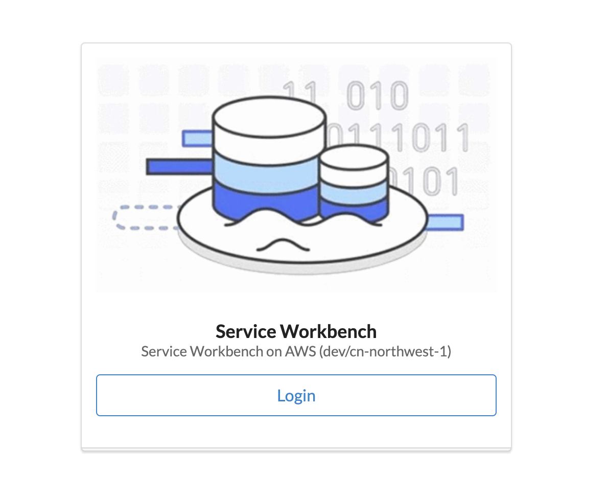

## 方案介绍
Service Workbench on AWS 是一个基于云计算的自服务式开源平台，便于IT团队为研究人员提供协作研究的解决方案。

- 它集成了多个AWS 服务，例如 Amazon CloudFront、AWS Lambda、AWS Step Functions 等。您可以使用 Service Workbench 创建自定义的研究环境模板并与其他组织共享这些模板。
- 同时，为了控制研究成本，Service Workbench 已与 AWS Cost Explorer 和 AWS Budgets 集成。您可以快速访问仪表板（dashboard)，参照预算查看您当前 AWS 服务的使用成本。
- Service Workbench 已与第三方服务提供商集成，以便在需要时启用。
- Service Workbench 还可以模拟本地环境中用户已知的概念，从而更轻松地切换到云技术。

Service Workbench on AWS 的详细介绍请参考[Service Workbench](/zh/introduction)

参考下面的架构图了解 Service Workbench 方案的具体架构：
[](img/SWB_Architecture.png)

## 前提条件

- 准备AWS账户，本次动手实践将在 **cn-northwest-1** 区域或 **ap-east-1** 区域进行，请确保已开通中国区 AWS 账户或全球区域 AWS 账户并启用香港区域

- 确保账户在 **cn-northwest-1** 或 **ap-east-1** 区域至少还可以创建一个VPC

- 启用AWS成本管理器，请参考[AWS 账户准备](/zh/installation_guide/installation/pre-installation/tool-req)

- 准备一个由 Amazon Route 53 管理的ICP许可域名， 如果是 Isengard 确保申请了ICP exception.
  :::tip

  本步骤仅对中国区域是必须的。
  本步骤完成后，请保存`hostedZoneId` 和 `domainName`，在部署Service Workbench时需要。

  :::

- 准备 [OIDC](https://openid.net/connect/) 供应商, 目前方案支持[Authing](https://www.authing.cn/)，[KeyCloak on AWS](https://www.amazonaws.cn/en/solutions/keycloak-on-aws/) 和 [Okta](https://www.okta.com/sg/) 作为IdP 供应商，本次动手实践以 Authing 为OIDC 供应商进行，请参考[Authing申请](/zh/installation_guide/installation/pre-installation/oidc-providers#authing-option-authingcn-oidc-客户端) 创建一个 **Authing application** 和 **root user**。
  :::tip

  本步骤完成后，请保存`App ID`，`Issuer`，`Email`，`Given Name` 和 `Family Name`的值，在部署Service Workbench时需要。

  :::   

## 准备部署Service Workbench的工作环境

- 准备部署Service Workbench的工作环境，您需要在 **cn-northwest-1** 或 **ap-east-1** 区域准备一个 Linux EC2 Instance，并在 EC2 instance 上安装所需要的软件，后续将通过该 EC2 instance 部署 Service Workbench。

    - 通过[cn-northwest-1 AWS EC2 Console](https://cn-northwest-1.console.amazonaws.cn/ec2/v2/home?region=cn-northwest-1#LaunchInstanceWizard:) 或 [ap-east-1 AWS EC2 Console](https://ap-east-1.console.aws.amazon.com/ec2/v2/home?region=ap-east-1#LaunchInstanceWizard:) 启动一个Linux EC2 Instance
        - AMI选择 **Amazon Linux 2 AMI (HVM) - Kernel 5.10, SSD Volume Type**
        - 类型: **t3.large**
        - EBS size: 建议40 GB
    - 通过[China AWS IAM Console](https://console.amazonaws.cn/iamv2/home#/users) 或 [Global AWS IAM Console](https://us-east-1.console.aws.amazon.com/iamv2/home?region=us-east-1#/users) 创建一个IAM user，授权**AdministratorAccess** 权限，保存Access key ID 和 Secret access key
    - 使用 **ec2-user** SSH 到 EC2 Instance, 执行下面命令配置aws config 和 credentials
        ```
        aws configure
        ```
       [](img/aws-configure.png)

    - 安装必要的软件
        - 安装nvm
        ```
        curl -o- https://raw.githubusercontent.com/nvm-sh/nvm/v0.35.3/install.sh | bash
        source ~/.bashrc
        ```
        :::tip

        如果上面命令由于网络原因执行失败，请重复执行，或者使用镜像站替代：
        ```
        wget -qO- https://raw.staticdn.net/nvm-sh/nvm/v0.35.3/install.sh | bash
        source ~/.bashrc
        ```
        :::

        - 安装nodejs，pnpm，serverless 和 hygen
        ```
        nvm install 14
        npm install -g pnpm@5.18.9
        npm install -g serverless hygen
        ```
        - 安装 golang
        ```
        sudo yum install -y golang
        ```

        - 验证软件是否安装成功
        ```
        node --version
        pnpm --version
        serverless -v
        go version
        ```

## 部署 Service Workbench

- 通过 EC2 Instance 部署 Service Workbench
    - 安装git
    ```
    sudo yum install -y git
    ```
    - 获取 Service Workbench 源码
    ```
    cd ~
    git clone https://github.com/awslabs/service-workbench-on-aws-cn.git
    ```
    :::tip
    如果由于网络原因获取源码失败，请重复执行，或者使用镜像站替代：
    ```
    git clone https://gitee.com/mirrors_awslabs/service-workbench-on-aws-cn.git
    ```
    :::    

    - 准备Stage Name环境变量和Stage配置文件:

      Stage name 用于允许来自同一帐户的多个 Service Workbench 部署, 它代表配置文件的名称。您可以选择自己的stage name, 但是不得超过五个字符。在本次实践中，我们将Stage name定义为 **dev**
    
      ```
      echo 'export STAGE_NAME=dev' >> ~/.bashrc
      source ~/.bashrc
      ```

      - 对于 **cn-northwest-1** 区域 :

        ```
        cd ~/service-workbench-on-aws-cn/main/config/settings
        cp workshop-cn.yml ${STAGE_NAME}.yml
        ```
        - 编辑 ${STAGE_NAME}.yml 文件,设定如下配置：

          ```
          oidcClientId: xxx
          oidcIssuer: xxx
          rootUserEmail: xxx
          rootUserFirstName: xxx
          rootUserLastName: xxx

          hostedZoneId: 
          domainName: 
          ```

          - `oidcClientId`, `oidcIssuer`, `rootUserEmail`, `rootUserFirstName`和 `rootUserLastName` 分别对应 `前提条件` 步骤中保存的 `App ID`，`Issuer`，`Email`，`Given Name` 和 `Family Name`

          - `hostedZoneId` 和 `domainName` 为 `前提条件` 步骤中保存的`hostedZoneId` 和 `domainName`

      - 对于 **ap-east-1** 区域:
        ```
        cd ~/service-workbench-on-aws-cn/main/config/settings
        cp workshop-hk.yml ${STAGE_NAME}.yml
        ```

        - 设定OIDC的相关配置，编辑 ${STAGE_NAME}.yml 文件，设定下列配置项：
            ```
            oidcClientId: xxx
            oidcIssuer: xxx
            rootUserEmail: xxx
            rootUserFirstName: xxx
            rootUserLastName: xxx
            ```
            - `oidcClientId`, `oidcIssuer`, `rootUserEmail`, `rootUserFirstName`和 `rootUserLastName` 分别对应 `前提条件` 步骤中保存的 `App ID`，`Issuer`，`Email`，`Given Name` 和 `Family Name`

            :::tip

            对于香港区域，方案部署完成后会提供可以直接访问的Cloudfront域名，如果需要使用本账户的Route 53管理域名，请按照下面步骤配置 `hostedZoneId`，`domainName` 和 `ACM证书`，如果不需要自定义域名，可直接开始部署Service Workbench阶段

            :::
        - 配置域名及证书：
            - 在 Amazon ACM 中生成证书：
              - 访问[Amazon Certificate Manager](https://us-east-1.console.aws.amazon.com/acm/home?region=us-east-1#/certificates/list)， 创建一个证书。
                  在`Fully qualified domain name`添加 `Service Workbench Domain`.
              - 点击进入证书，将`Domains` 中的`CNAME name` 和 `CNAME value` 保存。
              - 访问[Route 53](https://us-east-1.console.aws.amazon.com/route53/v2/hostedzones), 在之前创建好的Host Zone中创建一个 CNAME 类型的记录，记录名为上面创建的证书中的`CNAME name`，值为`CNAME value`.
              - 返回[Amazon Certificate Manager](https://us-east-1.console.aws.amazon.com/acm/home?region=us-east-1#/certificates/list)，等待证书状态变成`已颁发`状态
            - 编辑 ${STAGE_NAME}.yml 文件，底部添加下列配置项：
              ```
              hostedZoneId: 
              domainName: 
              certificateArn: 
              ```

              - `hostedZoneId` 和 `domainName` 为 `前提条件` 步骤中保存的`hostedZoneId` 和 `domainName`，`certificateArn` 为在Amazon ACM中生成的证书的ARN。

    - 部署Service Workbench：执行下面命令开始Service Workbench的部署

        ```
        cd ~/service-workbench-on-aws-cn
        go env -w GO111MODULE=on
        go env -w GOPROXY=https://goproxy.cn,direct    
        ./scripts/environment-deploy.sh ${STAGE_NAME}
        ```

        部署大概15 ~ 20分钟，如果出现下面的输出，代码Service Workbench部署完成
        [](img/swb-deploy-success.png)

        部署完成后访问`Website URL` 域名，并忽略HTTPS证书无效的错误。随后，如果出现下面登录页面则代表部署成功：
        [](img/swb-login-page.png)

## 使用 Service Workbench
- 使用的`rootUserEmail`登录Service Workbench.

- 添加一个 AWS 账户，参考[添加一个AWS 账户](/zh/user_guide/sidebar/admin/accounts/aws_accounts/invite_member_account)

- 创建一个索引，参考[创建一个索引](/zh/user_guide/sidebar/admin/accounts/indexes/create_new_index)

- 创建一个项目，参考[创建一个项目](/zh/user_guide/sidebar/admin/accounts/projects/create_project)

- 添加Root用户到项目，参考[添加用户到项目](/zh/user_guide/sidebar/admin/accounts/projects/add_user_to_project)

<a name="import_type"></a>

- 导入内置的Sagemaker 工作区类型, 参考[导入Sagemaker](/zh/post_deployment/import_service_catalog_products#amazon-sagemaker-的配置)
    - 选择导入**SageMaker Notebook** 工作区类型, 左侧菜单导航到 **工作区类型**，选择**SageMaker Notebook** 导入。
    [](img/choose-sagemaker-workspace.png)
    - 点击 **添加配置**， 根据页面提示对工作区类型进行基本配置
    [](img/add-workspace-config.png)
    - 在**输入参数**部分没有预设的字段为**Instancetype**和**AutoStopIdleTimeInMinutes**，根据页面提示填入相应的值
    [](img/set-sagemaker-config.png)
    - 导入完成后左侧菜单导航到 **工作区类型** 的 **工作区类型列表** 中会出现 **SageMaker Notebook**，选择**批准**
    [](img/approve-sagemaker.png)

- 创建一个数据集和上传数据，参考[Studies](/zh/user_guide/sidebar/common/studies/introduction)

- 添加一个Researcher 用户，参考[添加一个用户](/zh/user_guide/sidebar/admin/users/add_federate_user.md).

:::tip

请确保**Username**是电子邮件格式， **UserRole**选择 **researcher**， 选择**项目**

:::  

- 使用Researcher用户的电子邮件在Authing中创建一个用户，参考[在Authing中创建用户](/zh/installation_guide/installation/pre-installation/oidc-providers/#在authingcn创建用户)

- 编辑已经创建的Study，选择**权限**, 授予 Researcher 读写权限，参考[更改组织数据集的权限](/zh/user_guide/sidebar/common/studies/studies_page#更改组织数据集的权限)

- Logout root user, 使用上面创建的 Researcher 用户登录。

- 选择一个数据集和上面导入的 Sagemaker workspace type, 创建workspace，创建成功后数据集会自动mount到workspace中。参考[创建工作区](/zh/user_guide/sidebar/common/workspaces/create_workspace_study)

- 访问Sagemaker workspace, 参考 [访问SageMaker工作区](/zh/user_guide/sidebar/common/workspaces/accessing_a_workspace#连接到-sagemaker-和-emr-工作区)

- 结束workspace， 参考[结束Workspace](/zh/user_guide/sidebar/common/workspaces/terminating_a_workspace)

## 深入体验Service Workbench
  以上为Service Workbench的基本功能，后面可以继续深入体验Service Workbench的其他功能，主要包括:
- 生成自定义的AMIs
- 创建和启动 Rstudio Workspace
- 导入自定义的 workspace 模版

  如果不继续深入体验Service Workbench的其他功能，可直接跳至[删除Service Workbench](/workshop/workshop_guide/#删除-service-workbench) 清理Service Workbench的相关资源

## 生成自定义的AMIs，创建EC2 Windows 和 EC2 Linux 工作区类型
本章节介绍如何通过 packer生成AMIs，包括 EC2 Linux和 EC2 Windows，详细说明参考[安装AMIs](/zh/installation_guide/installation/ami-install)
- 安装 Packer
```
sudo yum install -y yum-utils
sudo yum-config-manager --add-repo https://rpm.releases.hashicorp.com/AmazonLinux/hashicorp.repo
sudo yum -y install packer
```   
- 生成 AMIs，大约需要10～15分钟
```
cd ~/service-workbench-on-aws-cn/main/solution/machine-images
pnpx sls build-image -s ${STAGE_NAME}
```

- 导入和创建EC2 Windows 和 EC2 Linux 工作区，参考[导入工作区类型](/zh/post_deployment/import_service_catalog_products) 和 [创建工作区](/zh/user_guide/sidebar/common/workspaces/create_workspace_study)

## 创建 Rstudio Workspace
RStudio workspace type 使用了AWS合作伙伴提供的模版和AMI，详细内容请[Rstudio Workspace](/zh/installation_guide/installation/rstudio.md)
- 获取 Rstudio 代码
```
cd ~
git clone https://github.com/RLOpenCatalyst/Service_Workbench_Templates.git
```
- 访问 [cn-northwest-1 Parameter Store](https://cn-northwest-1.console.amazonaws.cn/systems-manager/parameters?region=cn-northwest-1) 或 [ap-east-1 Parameter Store](https://ap-east-1.console.aws.amazon.com/systems-manager/parameters/?region=ap-east-1),获取 `workshop/jwt/secret` 的值，`workshop/jwt/secret` 是在Service Workbench部署过程中创建的JWT secret key。
- 创建secret.txt 文件，内容为`workshop/jwt/secret` 的值. 
```
cd ~/Service_Workbench_Templates/RStudio/machine-images/config/infra/files/rstudio
vi secret.txt
```
- Build Rstudio AMI
    - 安装 packer, 参考[Install Packer](https://learn.hashicorp.com/tutorials/packer/get-started-install-cli)
    ```
    sudo yum install -y yum-utils
    sudo yum-config-manager --add-repo https://rpm.releases.hashicorp.com/AmazonLinux/hashicorp.repo
    sudo yum -y install packer
    ```
    - 配置`~/Service_Workbench_Templates/RStudio/machine-images/config/infra/configuration.json` 中的下列配置项
    ```
        "aws_access_key": "xxx",
        "aws_secret_key": "xxx",
        "awsRegion": "xxx",
        "vpcId": "xxx",
        "subnetId": "xxx",
        "amiName": "Rstudio",
        "awsProfile": "default",
        "stageName": "dev"
    ```
    其中vpcId和subnetId填入default的VPC和Subnet即可。

    - Build Rstudio AMI
    ```
    cd ~/Service_Workbench_Templates/RStudio/machine-images/config/infra
    nohup packer build -var-file=configuration.json packer-ec2-rstudio-workspace.json >> ~/nohup.log 2>&1 &
    tail -f ~/nohup.log 
    ```

- 将Rstudio workspace template导入到Service Workbench中
    - 拷贝 `~/service-workbench-on-aws-cn/main/config/settings/$STAGE_NAME.yml` 到 `~/Service_Workbench_Templates/RStudio/machine-images/config/infra`
    ```
    cp ~/service-workbench-on-aws-cn/main/config/settings/$STAGE_NAME.yml ~/Service_Workbench_Templates/RStudio/machine-images/config/infra
    ```
    - 访问 [cn-northwest-1 service Catalog Portfolio](https://cn-northwest-1.console.amazonaws.cn/servicecatalog/home?region=cn-northwest-1#portfolios/?activeTab=localAdminPortfolios) 或 [ap-east-1 service Catalog Portfolio](https://ap-east-1.console.aws.amazon.com/servicecatalog/home?region=ap-east-1#portfolios?activeTab=localAdminPortfolios) 获取在部署Service Workbench过程中生成的`dev-nx-workshop` 或 `dev-hk-workshop` Portfolio Id. 
    - 添加`portfolioId`和`awsProfile`到 `~/Service_Workbench_Templates/RStudio/machine-images/config/infra/$STAGE_NAME.yml` 的最后，内容如下：
    ```
    portfolioId: port-xxx
    awsProfile: default
    ```
    - 导入 Rstudio workspace template
    ```
    cd ~/Service_Workbench_Templates/RStudio/machine-images/config/infra/
    pip3 install -i https://pypi.tuna.tsinghua.edu.cn/simple -r requirements.txt
    python3 create-rstudio.py
    ```
    访问 [cn-northwest-1 service Catalog Portfolio](https://cn-northwest-1.console.amazonaws.cn/servicecatalog/home?region=cn-northwest-1#portfolios/?activeTab=localAdminPortfolios) 或 [ap-east-1 service Catalog Portfolio](https://ap-east-1.console.aws.amazon.com/servicecatalog/home?region=ap-east-1#portfolios?activeTab=localAdminPortfolios)， 查看`EC2-RStudio-Server`是否已经添加成功

- 配置Rstudio Workspace type
    - 为Rstudio创建 ACM 证书
      - 访问[cn-northwest-1 Amazon Certificate Manager](https://cn-northwest-1.console.amazonaws.cn/acm/home?region=cn-northwest-1#/certificates/list) 或 [ap-east-1 Amazon Certificate Manager](https://ap-east-1.console.aws.amazon.com/acm/home?region=ap-east-1#/certificates/list)， 创建一个证书。
          在`Fully qualified domain name`添加 `Service Workbench Domain`和`*.Service Workbench Domain`.
      - 点击进入证书，将`Domains` 中的`CNAME name` 和 `CNAME value` 保存。
      - 访问[cn-northwest-1 Route 53](https://cn-northwest-1.console.amazonaws.cn/route53/v2/hostedzones) 或 [Global Route 53](https://us-east-1.console.aws.amazon.com/route53/v2/hostedzones), 在之前创建好的Hosted Zone中创建一个 CNAME 类型的记录，记录名为上面创建的证书中的`CNAME name`，值为`CNAME value`.
      - 返回[cn-northwest-1 Amazon Certificate Manager](https://cn-northwest-1.console.amazonaws.cn/acm/home?region=cn-northwest-1#/certificates/list) 或 [ap-east-1 Amazon Certificate Manager](https://ap-east-1.console.aws.amazon.com/acm/home?region=ap-east-1#/certificates/list)，等待证书状态变成`已颁发`状态
    - 参考 [导入 Workspace type](#import_type)，将EC2-RStudio-Server Workspace type导入，并配置Workspace Type, 需要填入下列配置：
    ```
    ACMSSLCertARN
    AmiId
    InstanceType
    ```

## 导入自定义的 workspace 模版
Service Workbench 除了内置的workspace template以外，还支持客户自定义workspace template，本章节将动手添加一个workspace template。
跟随手动实践创建一个内置反欺诈实验的Sagemaker Workspace Type
- 准备定制的workspace 模版

    - 准备模版中需要的反欺诈 Jupyter Notebook 脚本
    ```
    cd ~
    git clone https://github.com/awslabs/realtime-fraud-detection-with-gnn-on-dgl.git
    cp -r ~/realtime-fraud-detection-with-gnn-on-dgl/src/sagemaker ~/service-workbench-on-aws-cn/main/solution/post-deployment/config/environment-files/
    ```

    - 准备为SageMaker Notebook中提前预设环境所需要的脚本，在`~/service-workbench-on-aws-cn/main/solution/post-deployment/config/environment-files/` 路径下创建 `customize.sh` 文件，内容如下：
    ```
    #!/bin/bash
    set -e
    sudo -u ec2-user -i <<'EOF'
    cp -rf /usr/local/share/workspace-environment/sagemaker ~/SageMaker/
    cd ~/SageMaker/
    echo 'DGL == 0.6.*
    SageMaker >= 2.40.0, < 3.0.0
    awscli >= 1.18.140
    torch >= 1.6.0, < 1.7.0
    pandas
    sklearn
    matplotlib' >> requirements.txt

    nohup pip3 install -i https://pypi.tuna.tsinghua.edu.cn/simple -r requirements.txt &
    EOF
    ```

    - 以内置的SageMaker Workspace type为基础创建定制模版
    ```
    cd ~/service-workbench-on-aws-cn/addons/addon-base-raas/packages/base-raas-cfn-templates/src/templates/service-catalog/
    cp sagemaker-notebook-instance.cfn.yml sagemaker-notebook-instance-customize.cfn.yml
    ```
    - 添加定制的内容到`sagemaker-notebook-instance-customize.cfn.yml`

        - 在`OnStart:` section 中添加定制内容, 包括下载上面创建的customize.sh脚本以及执行该脚本：
        ```
                      aws s3 cp --region "${AWS::Region}" "${EnvironmentInstanceFiles}/customize.sh" "/tmp"
                      chmod 500 "/tmp/customize.sh"
                      /tmp/customize.sh
        ```

        - 在sagemaker-notebook-instance-customize.cfn.yml模版授权role必要的权限

            - 添加下面权限给InstanceRolePermissionBoundary

            ```
                      - Effect: Allow
                        Action: 'ecr:*'
                        Resource: '*'
            ```
            - 授权 `IAMRole` 权限, 创建下面的policy

            ```
                    - PolicyName: !Join ['-', [Ref: Namespace, 'customize-policy']]
                      PolicyDocument:
                        Version: '2012-10-17'
                        Statement:
                          - Effect: 'Allow'
                            Action: 's3:*'
                            Resource: !Sub 'arn:${AWS::Partition}:s3:::aws-gcr-solutions-assets/*'
                          - Effect: 'Allow'
                            Action: 'ecr:GetAuthorizationToken'
                            Resource: '*'
                          - Effect: 'Allow'
                            Action: 'ecr:BatchGetImage'
                            Resource: '*'                      
            ```

- 将模版导入Service Catalog
    - 将模版添加到Service Workbench 配置文件中
    ```
    cd ~/service-workbench-on-aws-cn/addons/addon-base-raas/packages/base-raas-post-deployment/lib/steps/
    vi create-service-catalog-portfolio.js
    ```
    内容如下到 `productsToCreate` 列表中：
    ```
      {
        filename: 'sagemaker-notebook-instance-customize',
        displayName: 'Sagemaker Customize',
        description: `An Amazon SageMaker Jupyter Notebook \n* Realtime Fraud Detection with Gnn On Dgl`,
      },
    ```

    - 将新创建的导入到Service Workbench中
    ```
    cd ~/service-workbench-on-aws-cn
    ./scripts/environment-deploy.sh ${STAGE_NAME}

    ```

    部署完成之后以Admin的身份访问Service Workbench， 进入`Workspace Types`, 如果页面显示`Sagemaker Customize` Workspace type, 代表定制的模版已经部署到了Service Workbench，参考 [导入 Workspace type](#import_type) 导入workspace type 进行即可。


## 删除 Service Workbench
参考[卸载 Service Workbench](/zh/installation_guide/uninstall) 卸载Service Workbench
