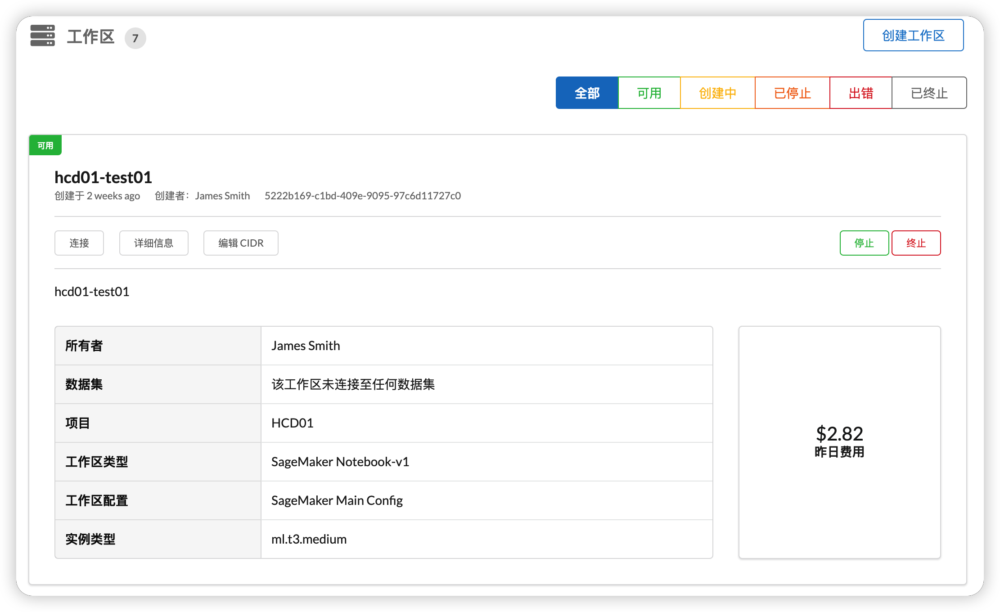
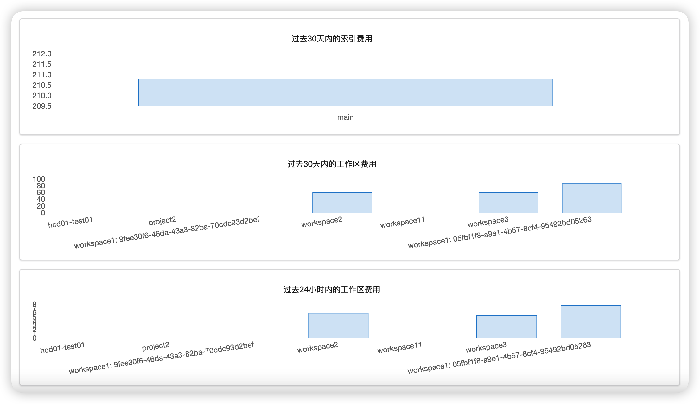
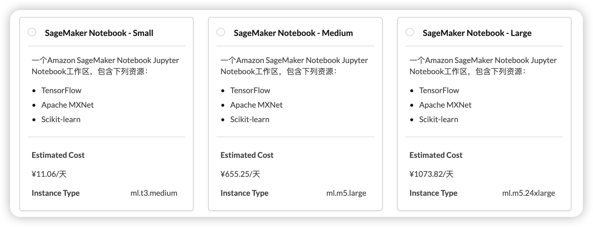

import useBaseUrl from '@docusaurus/useBaseUrl';

Service Workbench 集成了现有的 AWS 服务，例如 [Amazon CloudFront](https://docs.aws.amazon.com/AmazonCloudFront/latest/DeveloperGuide/Introduction.html)、[AWS Lambda](https://docs.aws.amazon.com/lambda/latest/dg/welcome.html) 和 [AWS Step Functions](https://docs.aws.amazon.com/lambda/latest/dg/lambda-stepfunctions.html)。 您可以使用 Service Workbench 创建自定义的研究环境模板并与其他组织共享这些模板。Service Workbench 还集成了 [AWS Cost Explorer](https://docs.aws.amazon.com/awsaccountbilling/latest/aboutv2/ce-getting-started.html)、[AWS Budgets](https://docs.aws.amazon.com/awsaccountbilling/latest/aboutv2/budgets-managing-costs.html) 和 [AWS Organizations](https://docs.aws.amazon.com/awsaccountbilling/latest/aboutv2/consolidated-billing.html)，从而提供成本透明度。

### 主账户

Service Workbench 部署在主账户中的架构如下所示。

### 托管账户

Service Workbench 部署计算资源到托管账户。

### 身份认证

Service Workbench 可以使用 Amazon Cognito 进行身份验证。 Amazon Cognito 可以与不同的身份验证提供商联合，例如 Active Directory、Auth0 或其他身份提供商。

:::note
    在 Amazon Cognito 不可用的区域，您可以使用 OIDC 提供身份验证。
:::   

### 存储

Service Workbench 将数据集分成三种类型：我的数据集、组织的数据集和开放数据。前两种类型是由您或整个组织或团体存储和维护的数据集。开放数据是指通过 [AWS Open Data](https://aws.amazon.com/opendata) 提供的数据。通过不断扫描开放数据集（datasets)可确保用户使用最新的开放数据集。

:::caution
    AWS Open Data 仅适用于部署在全球区域的情况。
:::

### AWS 服务目录

Service Workbench 的工作区管理最核心的是 [AWS Service Catalog](https://aws.amazon.com/servicecatalog)。系统会查找并管理用于定义工作区的研究环境模板。当您想要使用新的工作区类型时，可以在 AWS Service Catalog 中将其创建为 [AWS CloudFormation 模板](https://docs.aws.amazon.com/AWSCloudFormation/latest/UserGuide/Welcome.html)。

### 工作区管理

您不仅可以使用模板配置环境，还可以访问自己的工作区、查看账单详细信息或停用它们。

### 成本控制

#### 账户、索引和项目

Service Workbench 使用 AWS 账户来管理计算工作区。您可以为不同的项目、成本中心或其他目的使用不同的账户并管理成本。借助自动创建账号的功能，管理员可以使用 Service Workbench 界面在相同的 AWS 组织下生成新的 AWS 子账户。

#### 仪表板

仪表板将展示您的工作区或项目已累积的使用成本，这有助于您保持在预算内并发现消耗超出预期资源量的工作区。

### 工作区大小

从模板创建工作区时，除了多种环境选项外，您还可以选择工作区类型。管理员可以预定义这些大小并根据个人权限将它们与用户相关联。

