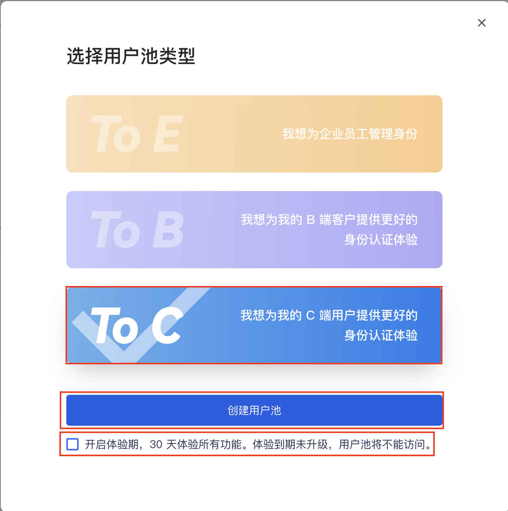
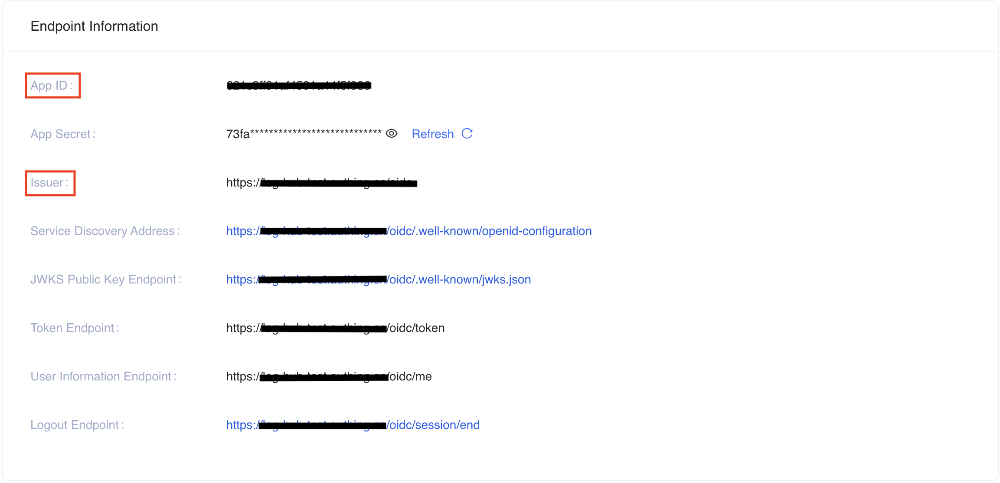
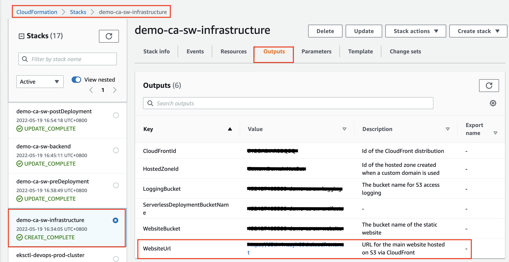
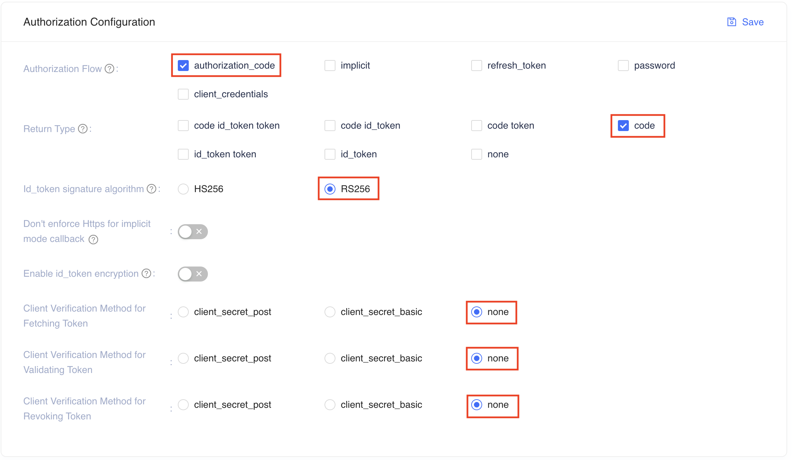
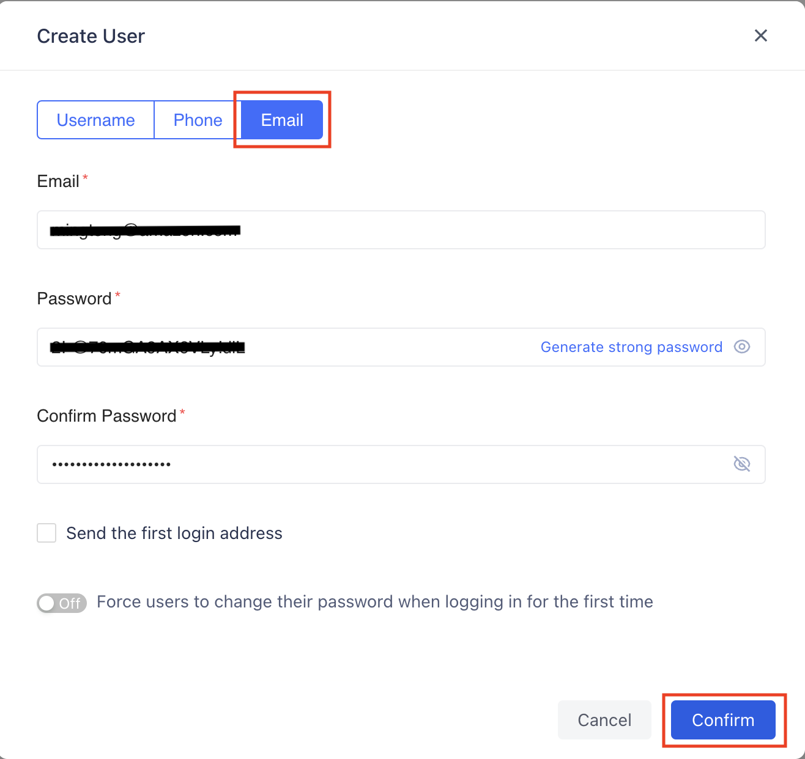
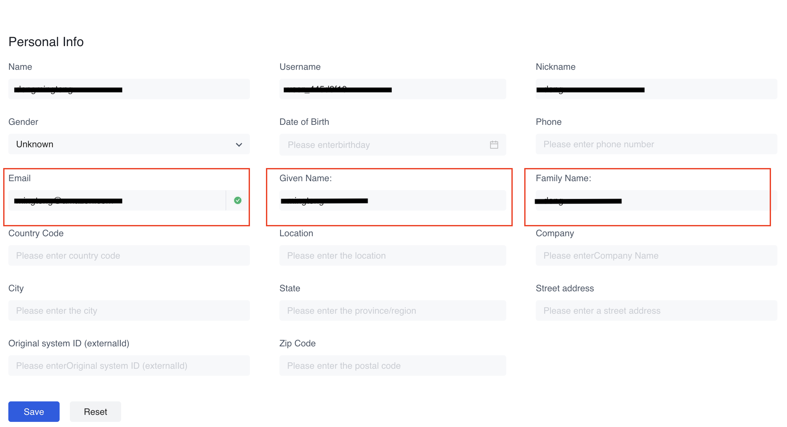
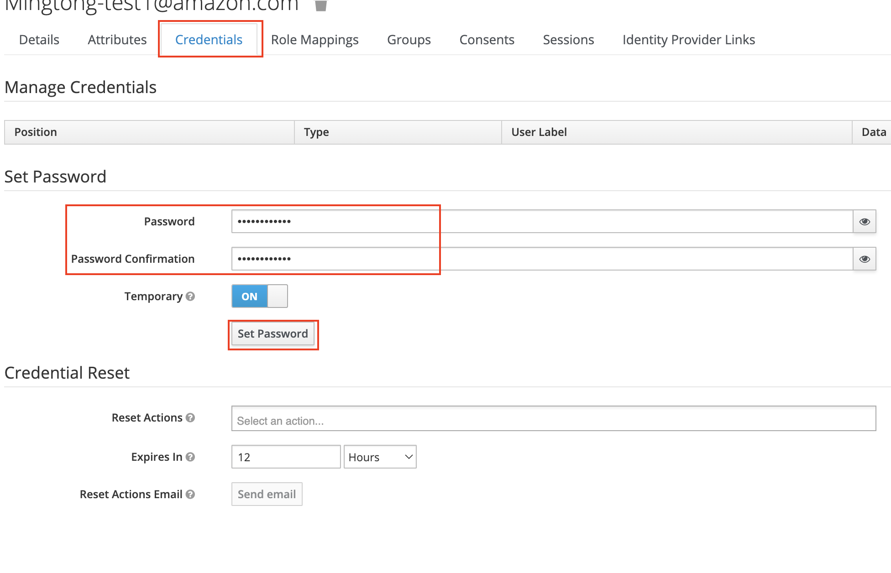
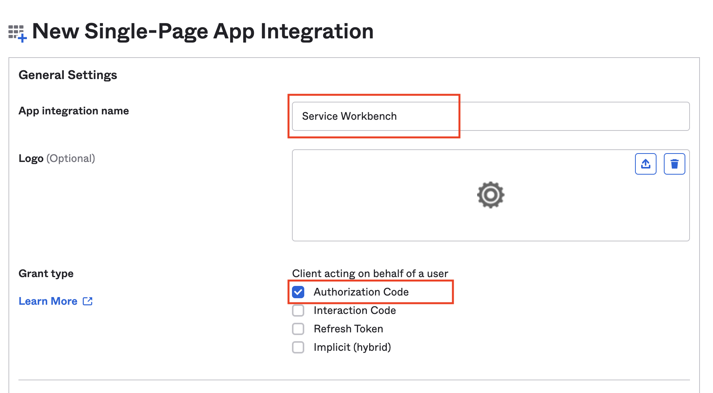
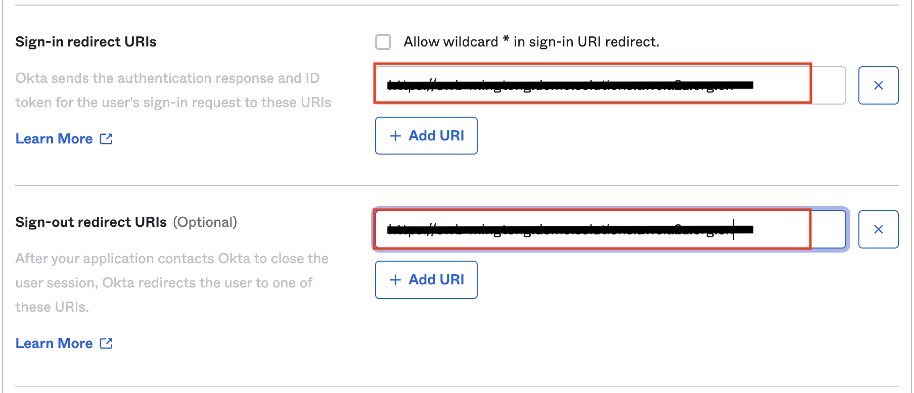
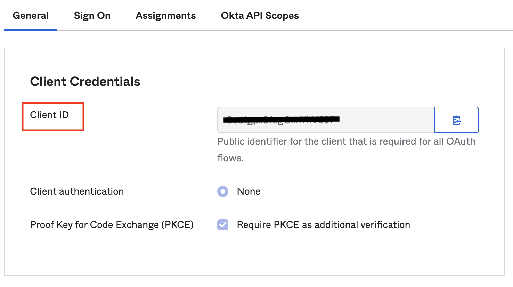

import useBaseUrl from '@docusaurus/useBaseUrl';

本节介绍如何创建 OIDC IdP 客户端和在 OIDC IdP 中创建 Service Workbench 根用户。

更多关于OIDC的信息，请参考 [OIDC](https://openid.net/connect/) 。

## 创建 OIDC IdP 客户端和用户

OpenID Connect (OIDC) IdP 是 [Cognito User Pool][cognito] 的替代方案，用于对 Service Workbench 进行身份验证。在使用 OIDC IdP 部署 Service Workbench 之前，您必须在外部 OIDC 服务中创建您的 OIDC 提供程序。

以下是在 Authing、Keycloak 和 Okta 中创建 OIDC 提供程序的示例过程，以供参考。您也可以使用其他 OIDC 提供程序。

- (选项1: Authing) [Authing][authing] 是第三方认证提供者的一个例子。
- (选项2: Keycloak on AWS) [Keycloak on AWS][keycloak-solution] 是 AWS 维护的解决方案，可以作为身份验证提供者。
- (选项3: Okta）[Okta][okta] 是一个值得信赖的平台，可以保护从客户到您的员工的所有身份信息。

按照以下步骤创建 OIDC 客户端，并获取`client_id`, `issuer`, `user_name`, `first_name`和`last_name`

### Authing 

####  创建 Authing.cn OIDC 客户端
1. 登录[认证控制台](https://console.authing.cn/console)。
2. 如果您没有用户池，请创建一个用户池。请选择 **To C** 类型，如果想使用长期免费的用户池，请**不要勾选** “开启体验期，30 天体验所有功能。体验到期未升级，用户池将不能访问。”选项。单击 **创建用户池** 按钮创建用户池。
    
3. 选择用户池。
4. 在左侧导航栏，选择**Applications**下的**Self-built App**。
5. 单击**Create**按钮。
6. 输入**Application Name**和**Subdomain**，选择**Regular Web APP**，单击**Create** 创建应用.
7. 将`App ID`（即`client_id`）和`Issuer`保存到Endpoint Information中的一个文本文件中，后面会用到。
    

8. 将`Login Callback URL`和`Logout Callback URL`更新为您的ICP记录的域名。
   例如，假设 Service Workbench 域名是 `www.swb-example.com`，请在 `Login Callback URL` 和 `Logout Callback URL` 中输入 `https://www.swb-example.com/`。
   :::tip

   请确保填入的URL以 "/" 结尾。

   :::

    

   如果不为 Service Workbench 使用自定义域，Service Workbench 会提供CloudFront域名来访问，所以需要将部署的Service Workbench CloudFront域名配置为`Login Callback URL`和`Logout Callback URL`。在部署Service Workbench之前，可以保留`Login Callback URL`和`Logout Callback URL`为`*`。 Service Workbench部署完成后，需要获取cloudfront domain并再次将其输入到`Login Callback URL`和`Logout Callback URL`中。
   
   * 获取CloudFront域名
   **CloudFormation**、**Stacks**、**xxx-infrastructure**、**Outputs**、**WebsiteUrl**，如下所示:
   
    

9. 设置授权配置。请在**Other configuration**的配置选项中按下图所示进行配置
    

您已经成功创建了一个身份验证自建应用程序。
更多信息请访问[authing文档](https://docs.authing.cn/v2/en/)。

#### 在Authing.cn创建用户

1. 登录[认证控制台](https://console.authing.cn/console)。
2. 选择**Users & Roles**, **Users**中单击**Create User**，选择 **Email**，输入`Email`和`Password`，点击**Confirm**创建用户。

    
3. 选择进入创建的用户，展开**Personal Info**，填写`Email`、`Given Name`和`Family Name`后保存。

    

    :::tip
    如果在**Personal Info** 中没有`Given Name`或`Family Name`，请选择边栏的**Setting**，**Field Management**，将 **Given Name** 和 **Family Name** 设定 **Visible from Console** 为 **Yes**，之后再次进入**Personal Info**进行编辑
    :::

### Keycloak on AWS

#### 创建 Keycloak OIDC 客户端
1. 按照[本指南][keycloak-solution]在AWS中国区域部署Keycloak解决方案。

2. 确保您可以登录 Keycloak 控制台。

3. 在左侧导航栏，选择**添加领域**。如果您已经有一个领域，请跳过此步骤。

4. 进入领域设置页面。选择 **Endpoints**，然后从列表中选择 **OpenID Endpoint Configuration**。

    

5. 在浏览器打开的 JSON 文件中，记录 **issuer** 值，稍后将使用该值。

    

6. 回到Keycloak控制台，在左侧导航栏选择**Clients**，然后选择**Create**。
7. 输入客户 ID，必须包含 24 个字母（不区分大小写）或数字。记录后面会用到的**Client ID**。
8. 更改客户端设置。在 `Valid Redirect URIs` 和 `Web Origins` 中输入您的ICP记录的域名。
   例如，假设 Service Workbench 域名是 `www.swb-example.com`，请在 `Valid Redirect URIs` 和 `Web Origins` 中输入 `https://www.swb-example.com/`。
   :::tip

   请确保填入的URL以 "/" 结尾。

   :::

    

   如果不为 Service Workbench 使用自定义域，Service Workbench 会提供CloudFront来访问，所以需要将部署的Service WorkbenchCloudFront配置为`Valid Redirect URIs`和`Web Origins`。在部署Service Workbench之前，可以保留`Valid Redirect URIs`和`Web Origins`为`*`。部署 Service Workbench 后，需要获取 cloudfront 域并再次将其输入到 `Valid Redirect URIs` 和 `Web Origins` 中。
   
   * 获取CloudFront域名
   **CloudFormation**、**Stacks**、**xxx-infrastructure**、**Outputs**、**WebsiteUrl**，如下所示:
   

颁发者值为`https://<KEYCLOAK_DOMAIN_NAME>/auth/realms/<REALM_NAME>`。

#### 在 Keycloak 中创建用户

1. 登录您部署的 Keycloak 管理控制台并选择您之前创建的 **realm**。

2. 选择**User**和**Add user**，输入`Username`、`Email`、`First Name`和`Last Name`，然后点击**Save**创建用户。
    

3. 创建用户后，选择**Credentials** 设置密码。
   

您已成功在 keycloak 中创建了一个用户。

### Okta

#### 创建 Okta OIDC 客户端

1. 登录[Okta 控制台](https://www.okta.com/)。
2. 如果您没有账户，请创建一个账户。
3. 访问开发者管理控制台。
3. 如果没有应用，创建应用，选择**Applications** -> **Application** -> **Create App Integration** -> **OIDC - OpenID Connect**和**单页应用程序**->单击**下一步**按钮。
5. 单击**创建**按钮。
6. 输入**App集成名称**，设置**Grant type**为**Authorization Code**。
    
7. 将“登录重定向 URI”和“退出重定向 URI”更新为您的 ICP 记录的域名。
   例如，假设 Service Workbench 域名是 `www.swb-example.com`，请为 `Sign-in redirect URIs` 和 `Sign-out redirect` 输入 `https://www.swb-example.com/` URI。
   :::tip

   请确保填入的URL以 "/" 结尾。

   :::
    

   如果不为 Service Workbench 使用自定义域，Service Workbench 会提供CloudFront域名来访问，所以需要将部署的Service Workbench CloudFront域名配置为`Sign-in redirect URIs`和`Sign-out redirect URIs`。在部署Service Workbench之前，可以保留`Sign-in redirect URIs`和`Sign-out redirect URIs`作为`*`。部署 Service Workbench 后，需要获取 cloudfront 域并再次将其输入到 `Sign-in redirect URIs` 和 `Sign-out redirect URIs` 中。
   
   * 获取Cloudfront域名
   **CloudFormation**、**Stacks**、**xxx-infrastructure**、**Outputs**、**WebsiteUrl**，如下所示:
   

8. 创建应用程序后，您可以获得`Client ID`（即`client_id`文本）和`Issuer`（即您的Okta URL，例如：`https://xxx.okta.com`）。请保存它们以供以后使用。
    

#### 在 Okta 中创建用户

1. 登录 [Okta 控制台](https://www.okta.com/) 管理控制台。
2. 选择**Directory**, **People** and **Add person**, 然后输入`First name`, `Last name`, `Username` and `Primary email`, 选择`I will set password`设置密码，然后点击**保存**。
    

您已在 Okta 中成功创建用户。

[cognito]:https://docs.aws.amazon.com/cognito/latest/developerguide/cognito-user-identity-pools.html
[openid-connect]:https://openid.net/connect/
[authing]:https://www.authing.cn/
[okta]:https://www.okta.com/sg/
[keycloak-solution]:https://www.amazonaws.cn/en/solutions/keycloak-on-aws/
