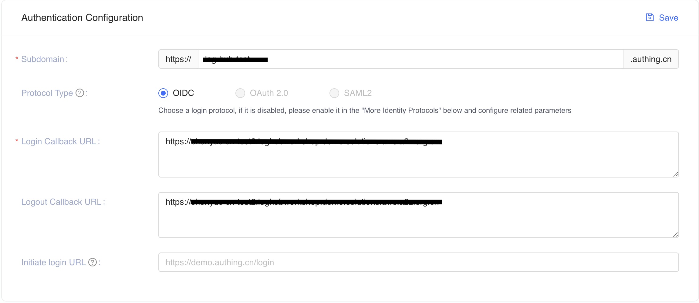
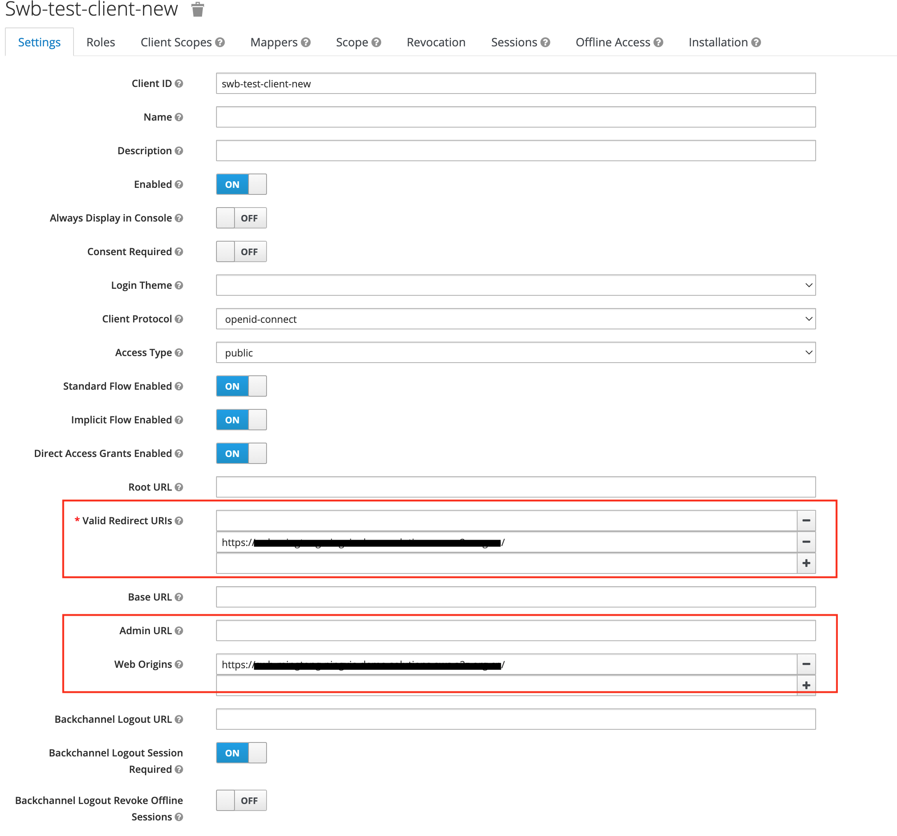

import useBaseUrl from '@docusaurus/useBaseUrl';

本节用于创建 OIDC IdP 客户端和在 OIDC IdP 中创建 Service Workbench 根用户。

## 创建 OIDC IdP 客户端

OpenID Connect (OIDC) IdP 是 [Cognito User Pool][cognito] 的替代方案，用于对 Service Workbench 进行身份验证。在使用 OIDC IdP 部署 Service Workbench 之前，您必须在外部 OIDC 服务中创建您的 OIDC 提供程序。

以下是在 Authing、Keycloak 和 Okta 中创建 OIDC 提供程序的示例过程，以供参考。您也可以使用其他 OIDC 提供程序。

- (Authing Option) [Authing][authing] 是第三方认证提供者的一个例子。
- (Keycloak on AWS Option) [Keycloak on AWS][keycloak-solution] 是 AWS 维护的解决方案，可以作为身份验证提供者。
- （Okta 选项）[Okta][okta] 是一个值得信赖的平台，可以保护从客户到您的员工的所有身份。

按照以下步骤创建 OIDC 客户端，并获取“client_id”和“issuer”。

### (Authing Option) Authing.cn OIDC 客户端

1、进入【认证控制台】（https://console.authing.cn/console）。
2. 如果您没有用户池，请创建一个用户池。
3. 选择用户池。
4. 在左侧导航栏，选择**Applications**下的**Self-built App**。
5. 单击**创建**按钮。
6. 输入**应用程序名称**和**子域**。
7、将`App ID`（即`client_id`）和`Issuer`保存到Endpoint Information中的一个文本文件中，后面会用到。
    

8. 将`Login Callback URL`和`Logout Callback URL`更新为你的IPC记录的域名。
   例如:假设我们的 Service Workbench 域是 `www.swb-example.com`，请在 `Login Callback URL` 和 `Logout Callback URL` 中输入 `https://www.swb-example.com/`。
    

   如果我们不为 Service Workbench 使用自定义域，Service Workbench 会提供云端域来访问。所以我们需要将部署的Service Workbench云端域配置为`Login Callback URL`和`Logout Callback URL`，在部署Service Workbench之前，我们可以保留`Login Callback URL`和`Logout Callback URL`为`*`。 Service Workbench部署完成后，我们需要获取cloudfront domain并再次将其输入到`Login Callback URL`和`Logout Callback URL`中。
   
   * 获取云端域名
   **CloudFormation**、**Stacks**、**xxx-infrastructure**、**Outputs**、**WebsiteUrl**，如下所示:
   
    

9. 设置授权配置。
    

您已经成功创建了一个身份验证自建应用程序。
更多信息请访问【认证文档】(https://docs.authing.cn/v2/en/)

### (AWS 上的 Keycloak 选项) Keycloak OIDC 客户端

1. 按照[本指南][keycloak-solution]在AWS中国区域部署Keycloak解决方案。

2. 确保您可以登录 Keycloak 控制台。

3. 在左侧导航栏，选择**添加领域**。如果您已经有一个领域，请跳过此步骤。

4. 进入领域设置页面。选择 **Endpoints**，然后从列表中选择 **OpenID Endpoint Configuration**。

    

5. 在浏览器打开的 JSON 文件中，记录 **issuer** 值，稍后将使用该值。

    

6.回到Keycloak控制台，在左侧导航栏选择**Clients**，然后选择**Create**。
7. 输入客户 ID，必须包含 24 个字母（不区分大小写）或数字。记录后面会用到的**Client ID**。
8. 更改客户端设置。在 `Valid Redirect URIs` 和 `Web Origins` 中输入 `https://<Service Workbench Console Domain>/`，如下图所示。

    

   如果我们不为 Service Workbench 使用自定义域，Service Workbench 会提供云端域来访问。所以我们需要将部署的Service Workbench云端域配置为`Valid Redirect URIs`和`Web Origins`，在部署Service Workbench之前，我们可以保留`Valid Redirect URIs`和`Web Origins`为`*`。部署 Service Workbench 后，我们需要获取 cloudfront 域并再次将其输入到 `Valid Redirect URIs` 和 `Web Origins` 中。
   
   * 获取云端域名
   **CloudFormation**、**Stacks**、**xxx-infrastructure**、**Outputs**、**WebsiteUrl**，如下所示:
   

颁发者值为`https://<KEYCLOAK_DOMAIN_NAME>/auth/realms/<REALM_NAME>`。

### (Okta 选项) Okta OIDC 客户端

1. 进入[Okta 控制台](https://www.okta.com/)。
2. 如果您没有帐户，请创建一个帐户。
3. 访问管理控制台。
3. 如果没有应用，创建应用，选择**Applications**, **Application**, **Create App Integration**, **Create App Integration**, **OIDC - OpenID Connect**和**单页应用程序**，单击**下一步**按钮。
5. 单击**创建**按钮。
6. 输入**App集成名称**，设置**Grant type**为**Authorization Code**。
    
7. 将“登录重定向 URI”和“退出重定向 URI”更新为您的 IPC 记录的域名。
例如:假设我们的 Service Workbench 域是 `www.swb-example.com`，请为 `Sign-in redirect URIs` 和 `Sign-out redirect 输入 `https://www.swb-example.com/` URI`。
    

   如果我们不为 Service Workbench 使用自定义域，Service Workbench 会提供云端域来访问。所以我们需要将部署的Service Workbench云端域配置为`Sign-in redirect URIs`和`Sign-out redirect URIs`，在部署Service Workbench之前，我们可以保留`Sign-in redirect URIs`和`Sign-out redirect URIs`作为`*`。部署 Service Workbench 后，我们需要获取 cloudfront 域并再次将其输入到 `Sign-in redirect URIs` 和 `Sign-out redirect URIs` 中。
   
   * 获取云端域名
   **CloudFormation**、**Stacks**、**xxx-infrastructure**、**Outputs**、**WebsiteUrl**，如下所示:
   

8. 创建应用程序后，您可以获得`Client ID`（即`client_id`）文本和`Issuer`，即您的Okta URL。请保存它们以供以后使用。
    

## 在 OIDC IdP 中创建 Service Workbench 根用户

在部署 Service Workbench 之前，您需要在您的 OIDC IdP 中创建一个用户，如果您没有用户，该用户将用作 Service Workbench 的 root 用户。
按照以下步骤创建用户并获取“user_name”、“first_name”和“last_name”。

###在Authing.cn创建用户

1. 登录【认证控制台】（https://console.authing.cn/console）。
2. 选择**Users & Roles**, **Users**, **Create User** and **Email**，输入`Email`和`Password`，点击**Confirm**创建用户。

    
3. 编辑**个人信息**，确认`Email`、`Given Name`和`Family Name`已经填写完毕。

    

您已成功在 authing 中创建了一个用户。

### 在 Keycloak 中创建用户

1. 登录您部署的 Keycloak 管理控制台并选择您之前创建的 **realm**。

2. 选择**User**和**Add user**，输入`Username`、`Email`、`First Name`和`Last Name`，然后点击**Save**创建用户。
    

3. 创建用户后，选择**Credentials** 设置密码。
   

您已成功在 keycloak 中创建了一个用户。

### 在 Okta 中创建用户

1. 登录 [Okta 控制台](https://www.okta.com/) 管理控制台。
2. 选择**Directory**, **People** and **Add person**, 然后输入`First name`, `Last name`, `Username` and `Primary email`, 选择`I will set password`设置密码，然后点击**保存**。
    

您已在 Okta 中成功创建用户。

[cognito]:https://docs.aws.amazon.com/cognito/latest/developerguide/cognito-user-identity-pools.html
[openid-connect]:https://openid.net/connect/
[authing]:https://www.authing.cn/
[okta]:https://www.okta.com/sg/
[keycloak-solution]:https://www.amazonaws.cn/en/solutions/keycloak-on-aws/
