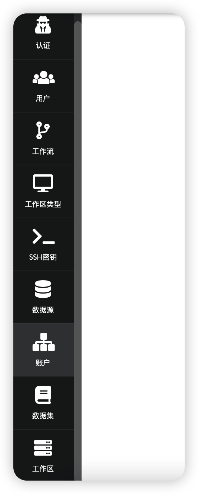
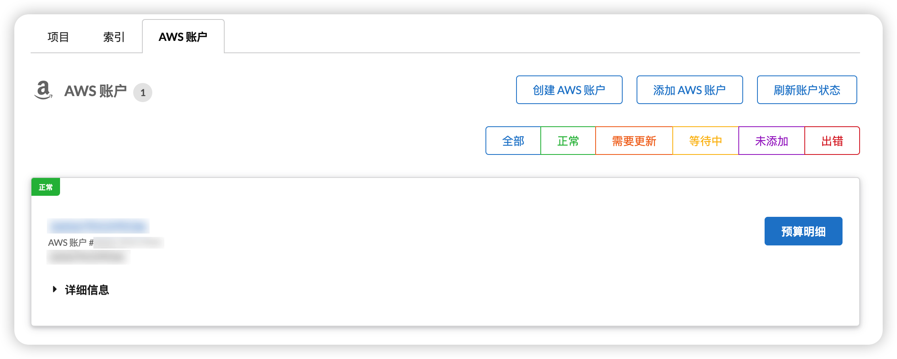
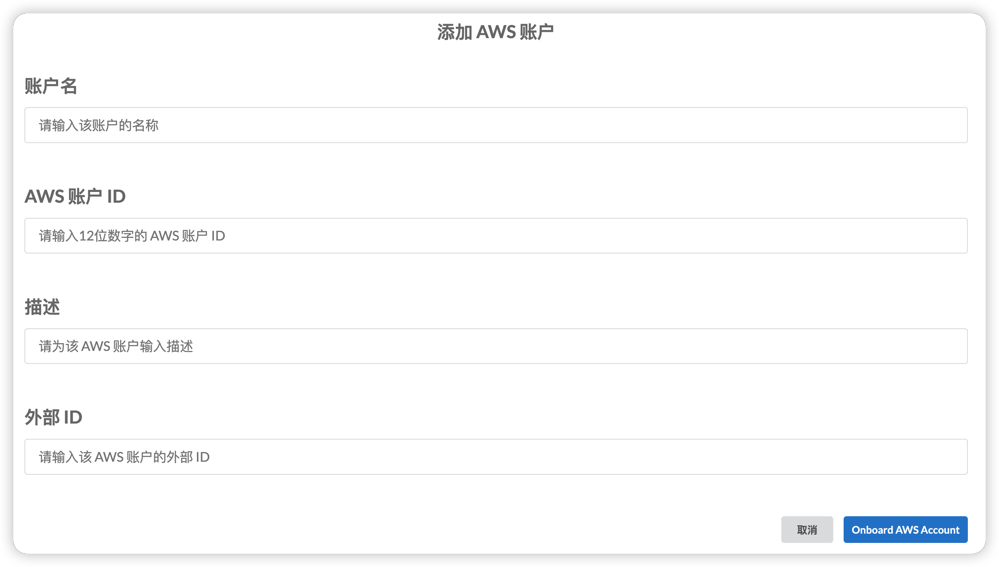
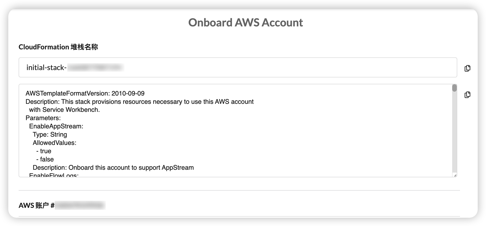
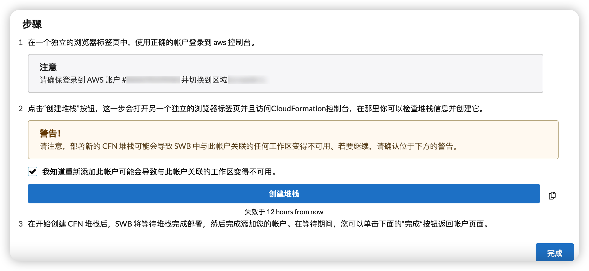

import useBaseUrl from '@docusaurus/useBaseUrl';

首次以 **root** 用户登录后，进入 [SideBar](/zh/user_guide/introduction) 中的“**账户**”页面。 Service Workbench 使用此页面上的 AWS 账户来启动研究工作区。您可以在“**账户**”选项卡上添加现有 AWS 账户或创建新账户。账户负责在 Service Workbench 中部署的资源所产生的费用。

* **添加 AWS 账户**：导入现有的 AWS 账户，该账户将负责自己的计费。

每个用户都通过**项目**和**索引**关联到一个**账户**，因此在创建第一个用户之前必须至少创建或添加一个账户。

**重要提示：**如果您不需要在 Service Workbench 中创建新的 AWS 账户，请跳到下一部分，“添加 AWS 账户”部分。

## 添加计算托管账户

首次以root用户登录后，进入**账户**页面。

**图：Service Workbench 导航栏**

Service Workbench 使用此页面上的 AWS 账户来启动研究工作区。您可以在 **账户** 选项卡上添加现有 AWS 账户。

+ **添加 AWS 账户**：关联现有 AWS 账户以托管计算资源。此账户可以负责自己的帐单。

每个用户都通过项目和索引链接到一个账户，因此在将第一个用户关联到项目之前，必须至少创建或添加一个账户。

**注意**：如果您不需要从 Service Workbench 中创建新的 AWS 账户，请跳至添加 AWS 账户部分。

## 添加 AWS 账户

添加现有 AWS 账户使 Service Workbench 能够启动研究工作区。现有账户与主账户的关系（独立或与组织相关联）决定了计费责任。

1. 在 **账户** 页面上，选择 **AWS Accounts**，然后选择 **Add AWS Account**。

     
 
     **图：添加现有账户**

2. 创建并运行 AWS CloudFormation 模板。

### 如果 AppStream 未启用

+ 输入 **Account Name**、**Account ID**（您要添加的账户的 12 位 AWS 账户 ID）和 **Description**。

**图：指定账户详情**

+ 点击 **Onboard AWS Account** 按钮，随后将显示 **Onboard AWS Account** 窗口：

**图：Onboard AWS 账户**

## 创建 RStudio ALB 工作区

### 访问 RStudio 工作区

您可以使用 AWS 合作伙伴的 
[repository](https://github.com/RLOpenCatalyst/Service_Workbench_Templates)中提供的模板和 AMI 访问 RStudio 工作区类型。 RStudio legacy 和 RStudio ALB 都使用自定义域名。您可以在 `/main/config/settings/<stage.yml>` 中定义自定义域名。

### RStudio ALB 工作区的应用程序负载平衡

当您创建 RStudio Application Load Balancer (ALB) 工作区时，会创建一个 ALB，每个托管账户最多可以托管 100 个工作区。每个工作区最多可以有 4 个 CIDR 块（IP 范围），仅用于端口 443。这是在托管账户中更新的。如果该主机账户没有 ALB，并且您已经创建了第一个工作区，则将首次创建 ALB，并且对于您随后创建的每个工作区都是通用的。终止所有工作区并终止该主机账户的最后一个工作区后，将删除 ALB。为至少一个活动工作区创建 ALB。

每个工作区类型对应一个侦听器规则，并且可以有 100 个这样的规则。在每个规则中，用户可以指定用户想要加入白名单的 IP 范围。每个侦听器规则最多只能指定 4 个 IP 范围。有关 ALB 的更多信息，请参阅 [Application Load Balancer](https://docs.aws.amazon.com/elasticloadbalancing/latest/application/introduction.html)。

### 限制

1. 使用 RStudio ALB 实施，每个主机账户最多只能创建 100 个工作区。
2. 每个工作区，您最多只能为端口 443 指定 4 个 CIDR 块。
