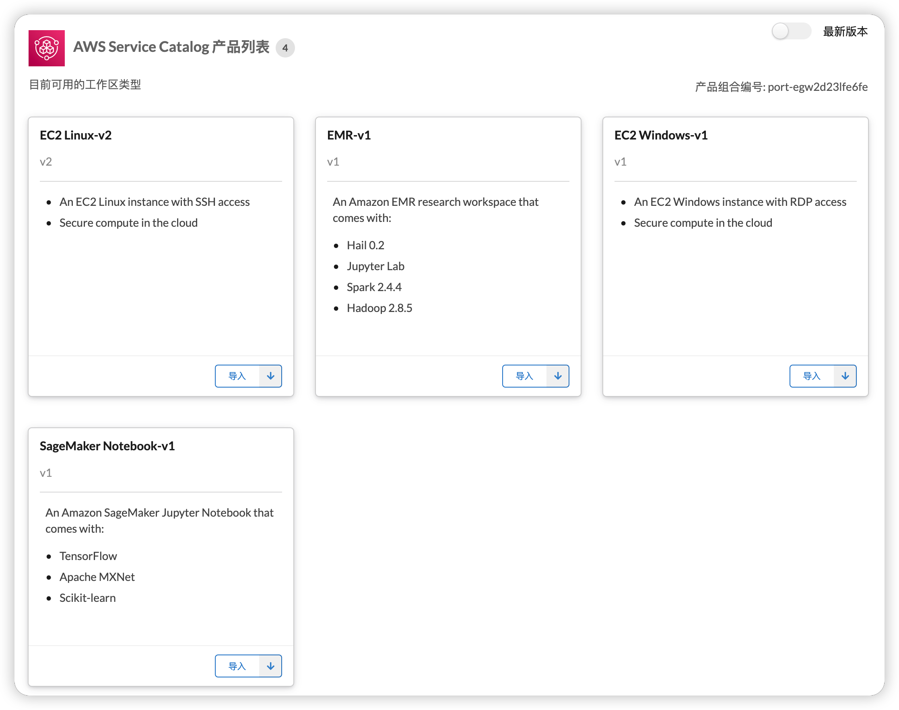
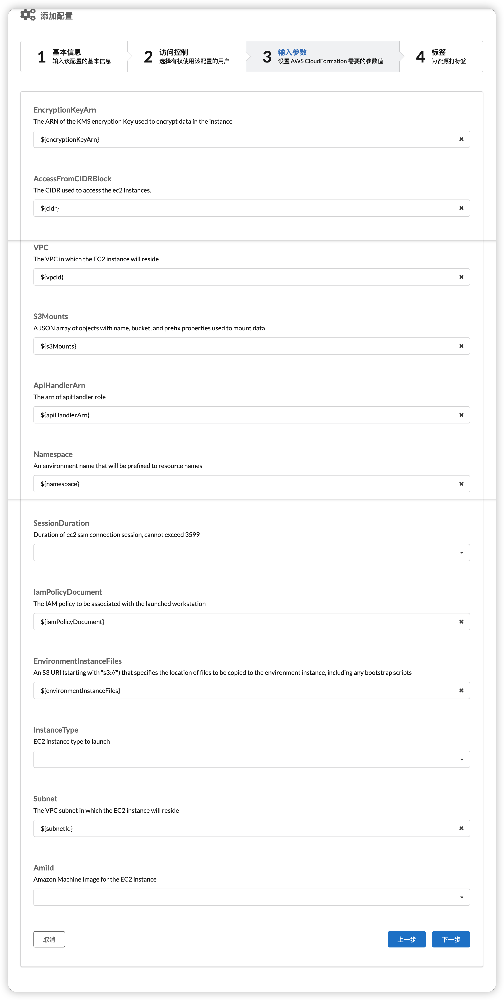
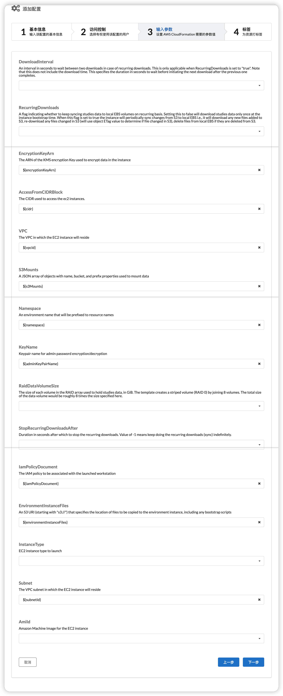
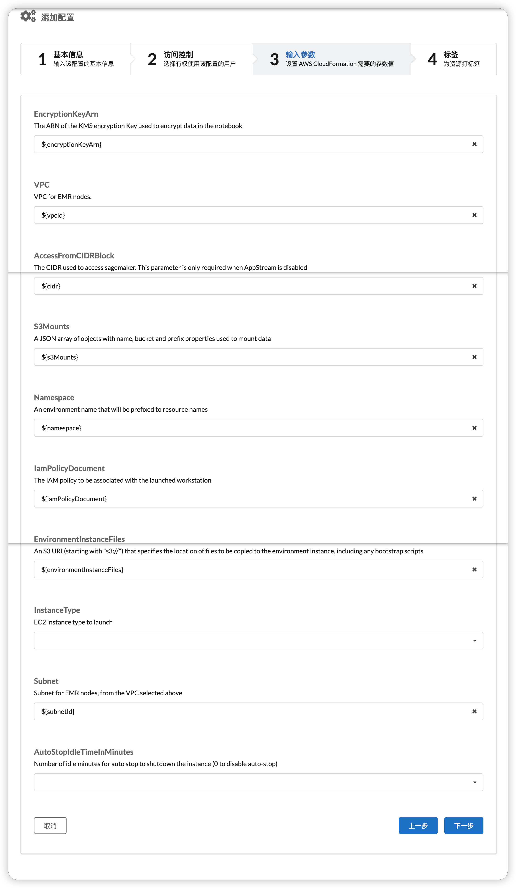
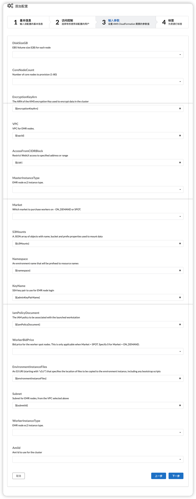

import useBaseUrl from '@docusaurus/useBaseUrl';

Service Workbench 使用 [AWS 服务目录 - AWS Service Catalog](https://aws.amazon.com/servicecatalog/?aws-service-catalog.sort-by=item.additionalFields.createdDate&aws-service-catalog.sort-order=desc)
管理可供研究人员通过该平台使用的不同类型的计算资源。

通过集成 AWS Service Catalog，Service Workbench 允许管理员用户创建和管理获准在 AWS 上使用的 IT 服务。这些 IT 服务可以包括从虚拟机映像、服务器、软件和数据库到完整的多层应用架构的所有内容。

通过这种集成，Service Workbench 可帮助组织集中管理经常部署的 IT 服务，并帮助实现统一的治理和满足合规性要求，同时使用户能够快速部署所需的经过批准的 IT 服务。

部署 Service Workbench 时，默认情况下会创建一个 AWS Service Catalog 产品组合，其中包含四种常用产品：Amazon SageMaker、适用于 Windows 的 Amazon EC2、适用于 Linux 的 Amazon EC2 和 Amazon EMR。管理员需要使用 Service Workbench 用户界面导入和配置这些产品，然后用户才能部署它们。如果您想在 AWS Service Catalog 产品组合中包含其他自定义产品，请完成以下步骤：

1. 在以下目录中添加 AWS CloudFormation 模板：
`addons/addon-base-raas/packages/base-raas-cfn-templates/src/templates/service-catalog`
2. 在以下位置的 productsToCreate 列表中添加 AWS CloudFormation 模板文件名：
`addons/addon-base-raas/packages/base-raas-post-deployment/lib/steps/create-service-catalog-portfolio.js`
3. 部署Service Workbench。

注意：如果产品直接在 AWS 管理控制台的 Service Catalog 中更新，则无法保证通过 Service Workbench 自动更新它们的版本。

## 导入产品

在此步骤中，您导入预定义的产品，配置要用于产品发布的参数，并批准要使用的配置产品。以下部分以 Amazon EC2 Linux 为例，然后设置 Amazon EC2 Windows、Amazon SageMaker 和 Amazon EMR 所需的不同配置。

### 先决条件

确保满足以下先决条件才能导入产品。

#### 创建 AMI

确保您在部署过程中完成了步骤[安装 AMIs](/zh/installation_guide/installation/ami-install)。

**注意**：对于Amazon EC2 Linux和Amazon EC2 Windows，如果没有定制AMI的需求，也可以使用AWS官方提供的AMI。

您可以检查 AMI 是否已成功创建：

1. 导航到 Amazon EC2。
2. 选择 AMI 选项卡。
3. 记下为 Amazon EC2 Linux、Amazon EC2 Windows、Amazon EMR 和 Amazon EC2 RStudio 创建的四个 AMI。
4. 复制 AMI ID 并用于工作区导入和配置。或者，您也可以在部署机器映像 SDC 时从终端复制这些 AMI ID。

**注意**：如果您多次运行机器映像 SDC，则会创建重复的 AMI。这没关系，不会影响任何 Service Workbench 功能。您可以选择删除重复项以避免混淆或保留它们。

#### 查看服务目录组合

1. 以**管理员**身份登录 Service Workbench UI。
2. 导航到“**工作区类型**”选项卡。四个 AWS Service Catalog 产品显示如下。

***图：AWS Service Catalog 产品***

这四种产品来自系统在部署期间创建的 AWS Service Catalog 产品组合。一旦导入和配置，它们就可以使用了。

如果您希望将来包含其他 AWS 计算资源：

1. 将新产品添加到 AWS Service Catalog 中的现有 Service Workbench 产品组合。
2. 更新[cloudformation.yml](https://github.com/awslabs/service-workbench-on-aws/blob/mainline/main/solution/post-deployment/config/infra/cloudformation.yml#L204)中的角色`ServiceCatalogLaunchConstraintRole`，从而添加启动和终止产品所需的权限。

### 导入工作区

本节以 Amazon EC2 Linux 为例。

1. 在“ec2-linux-instance”下选择“**Import**”。
2. 输入**名称**和**描述**，以便您轻松识别工作区。

### 配置工作区

导入工作区类型后，请执行以下操作：

1. 选择“**添加配置**”。
2. 输入配置的**ID**、**Name**、**Description** 和**Estimated Costs**。这里的一个常见命名规范是在产品名称之后附加实例大小。例如，对小型 Linux Amazon EC2 实例使用“ec2-linux-instance-V1-small”。
3. 选择“**下一步**”。
4. 输入工作区配置的访问控制。
5. 选择“**下一步**”。

输入参数是用于产品 AWS CloudFormation 模板的参数。不同产品的参数数量和类型不同。用于四个系统创建产品的大多数参数可以在启动时自动评估。这些参数可在填写输入参数页面时在下拉列表中进行选择。

### EC2 Linux 的配​​置

对于 Amazon EC2 Linux，下拉列表中仅有的两个没有预置值的字段是 **InstanceType** 和 **AmiId**。

下图显示了示例 Amazon EC2 Linux 配置。

***图：Amazon EC2 Linux 的配​​置***

### Amazon EC2 Windows 的配置

对于 Amazon EC2 Windows，下拉列表中仅有的两个没有预置值的字段是“**InstanceType**”和“**AmiId**”。 （使用您在先决条件 - AMI 中复制的 AMI ID）

下图显示了示例 Amazon EC2 Windows 配置。

***图：EC2 Windows 的配置***

### Amazon SageMaker 的配置

对于 Amazon SageMaker，下拉列表中唯一没有预置值的的字段是“**InstanceType**”。

下图显示了示例 Amazon SageMaker 配置。

***图：Amazon SageMaker 的配置***

### Amazon EMR 的配置

**注意**：如果为部署启用了 AppStream，则 EMR 工作区不可用。因此，无需为此工作区导入或添加配置。

Amazon EMR 还需要额外一些在下拉菜单中没有预置值的字段，包括：
- 磁盘大小GB (>=10)
- 核心节点数（1-80）
- MasterInstanceType
- 市场（ON_DEMAND / SPOT）
- WorkerBidPrice（仅在 Market = SPOT 时适用。为 Market = ON_DEMAND 指定 0）
- WorkerInstanceType
- AmiId（使用我们在 AMI 先决条件中复制的 AMI id）

下图显示了示例 Amazon EMR 配置。

***图：Amazon EMR 的配置***

## 批准工作区

配置完成后，选择 **Approve** 按钮。新创建的工作区类型将可在 **Study and Workspace** 选项卡中启动。
