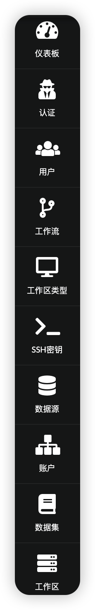

import useBaseUrl from '@docusaurus/useBaseUrl';

本文档的这一部分旨在概述如何操作作为此解决方案的一部分提供的基于 Web 的用户界面。
用户界面在屏幕左侧（侧边栏）显示一个菜单栏，其中包含一组链接到 Web 界面不同功能的图标。

根据用户在登录用户界面时所拥有的角色，部分或全部菜单项将可用。
目标是只向用户展示与工作相关的条目，而不是将它们与其他不相关的条目混淆。

根据用户的角色，边栏中提供了以下条目。

<table>
<tr>
<td 宽度="150">

</td>
<td>
<b>仪表板</b>

显示过去 30 天的支出

<b>授权</b>

列出在 Service Workbench 中配置的身份验证提供程序。这个
包括默认（本地账户）和任何 Active Directory id 实体
提供者。

<b>用户</b>

创建和管理本地和联合用户和角色。

<b>工作流程</b>

监控并查看由管理界面启动的操作历史。这包括配置[账户](/zh/post_deployment/aws_accounts) 以及创建和删除[工作区](/zh/user_guide/sidebar/common/workspaces/introduction)

<b>账户</b>

创建和管理账户。请参阅[账户结构](/zh/user_guide/account_structure)了解
AWS 账户和 Service Workbench 账户之间的关系，参阅[账户](/zh/post_deployment/aws_accounts)了解如何管理账户

<b>数据集</b>

请参阅[数据集](/zh/user_guide/sidebar/common/studies/introduction)

<b>工作区</b>

请参阅[工作区](/zh/user_guide/sidebar/common/workspaces/introduction)

</td>
</tr>
</table>
