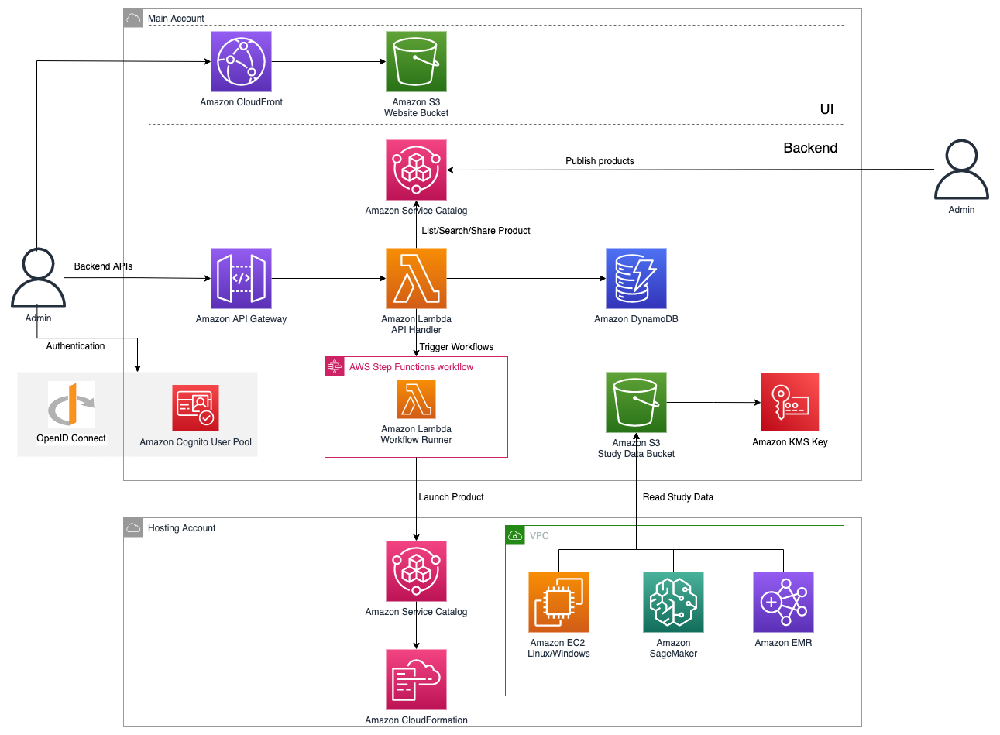
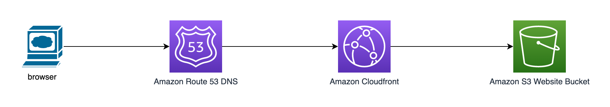
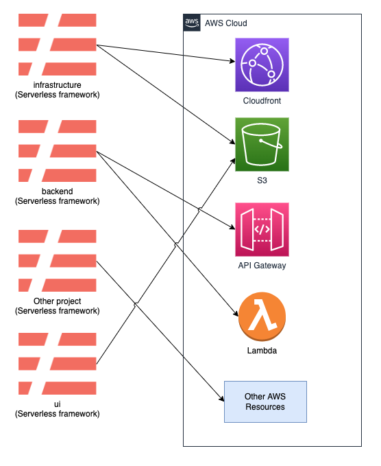
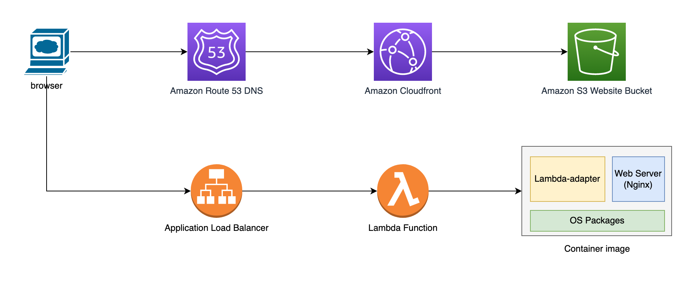
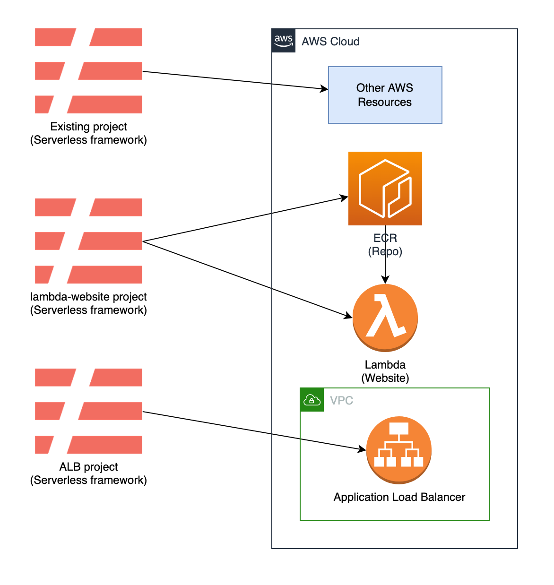
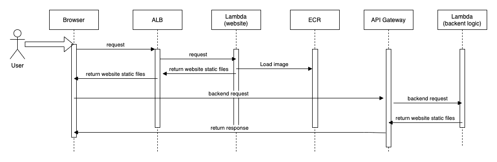

# Summary
This RFC proposes is to design a new architecture to make service workbench can:
- be deployed and used in china regions without ICP domain.
- be deployed the entire solution inside VPC with secure network access

# Motivation
Service Workbench is an open-source web application that provides a self-service and push-button provisioning experience of ready-to-use IT environments for research projects or classroom experiments on AWS. It is exposed by cloudfront. But in china regions, cloudfront cannot be accessed directly from public, so we need to apply a ICP domain to connect cloudfront. But some customers don't have ICP domain or want to try service workbench solution quickly, the issue of ICP domain is a blocker for above customers. So the service workbench need a feature to make customer use it in china regions without ICP domain. 

## What are we doing today?
The current architecture is that Service Workbench is exposed by cloudfront, in global regions, customers can access service workbench through cloudfront domain or customers' domain. But in china regions, customers can only access service workbench through customers' ICP domain, because cloudfront domain cannot be accessed directly in china regions. 
Current implementation already works for most customers, but there are two issues:
1. Before deploying and using service workbench, customers have to apply ICP domain.
2. Customers cannot deploy service workbench to be accessed only in private network.

## What are we proposing to do?
This RFC proposes to release the Service Workben to support below features:
1. Support customers configure to deploy and use service workbench in china regions whatever with or without ICP domain.
2. Support customers to only use servcie workbench in private network.
3. Support customers to limit ip range to access service workbench.

# Current implementation of service workbench

## High level design of service workbench



According to this diagram, we can know there are two parts related with our new features:
1. Front-end part: All front-end static files are stored in S3 bucket, and cloudfront distributes these static files to customers browser. Customers need to register cloudfront domain to the ICP domain to make cloudfront domain accessable in china regions.
2. Deployment part: Build website statices files, create cloudfront, S3 bucket.

## Front-end loading part
In china regions, when users input the url of service workbench into browser, such as https://example-serviceworkbench.com, these requests are sent to cloudfront through domain name resolution, then forward request to S3 to get static files, such as html, css and js files while the cache is missing.
After browser gets these static files, browser will display service workbench UI to user.


## Deployment part:
The service workbench is based on serverless framework to deploy to AWS account.
There are several serverless project to setup service workbench as below:
1. infrastructure
2. pre-deployment
3. backend
4. post-deployment
5. ui


- The infrastructure project is responsible for creating cloudfront and S3 bucket and then return cloudfront domain. 
- The backend project is responsible for creating API gateway and then return API URL. 
- The ui project is responsible for building front-end static files and upload them to the S3 bucket.

# Design Summary
## High level design.

As above diagram shown.
The new architecture will be compatible with existing functions.
The Application Load Balancer(ALB) is a feature of Elastic Load Balancing that allows a developer to configure and route incoming end-user traffic to applications based in the AWS public cloud. We choose ALB to expose service workbench portal. Why do we choose application loader balancer, there are below reasons:
1. ALB providers the domain, so customers do not need to apply ICP domain.
2. Customers can set any listener port, such as 8000. so it is not necessary to apply ICP exception.
3. We can set ALB VPC and security group to limit access in network layer.

Lambda is a compute service that lets you run code without provisioning or managing servers. Lambda runs your code on a high-availability compute infrastructure and performs all of the administration of the compute resources, including server and operating system maintenance, capacity provisioning and automatic scaling, and logging. We choose lambda function with container to host front-end static files. The benefit are:
1. Serverless is easy to deploy and low cost.
2. Container image is easy to upgrade, do not need to stop the service.
3. Do not need to involve other servcies.

## Detail Design and Implementation:
### Added Configurations
Before deploying the service workbench, customers need to set belows configurations:
```
enableAlb: true/false
albSubnetIdList: 'subnetId01,subnetId02'
albVpcId: 'vpcId'
```
**enableAlb**: customers can set the value as true to enalbe Application Load Balancer to expose servcie workbench web portal. The default value is false, 
**albVpcId** and **albSubnetIdList**: customers need to set these two configurations to indicate the Application Load Balancer created in which VPC and Subnets.

### Deployment processing
During the deployment processing, all new resources need to be created, such as Application Load Balancer, new Lambda Function, website container image.

As above diagram shown, there are two serverless framework project added, **alb** and **lambda-website**.
1. **alb**
This project is responsible for create belows aws resources:
- Application Load Balancer
- Security Group
- Target Group

There will be a serverless.yml and cloudformation.yml files to define how to set above reources.
serverless.yml
```
provider:
  name: aws
  region: ${self:custom.settings.awsRegion}
  profile: ${self:custom.settings.awsProfile}

custom:
  settings: ${file(./config/settings/.settings.js):merged}  

resources:
  - Description: Service-Workbench-on-AWS ${self:custom.settings.version} ${self:custom.settings.solutionName} ${self:custom.settings.envName} Alb-Website-Deployment
  - ${file(./config/infra/cloudformation.yml)}
```

cloudformation.yml
```
...
Resources:
  LoadBalancer:
    Type: AWS::ElasticLoadBalancingV2::LoadBalancer
    Properties:
      Scheme: internet-facing 
      Subnets: !Ref Subnets
      SecurityGroups:
      - !Ref LoadBalancerSecurityGroup

  LambdaTargetGroup:
    Type: AWS::ElasticLoadBalancingV2::TargetGroup
    Properties:
      TargetType: lambda
      Targets:
      - Id: ${self:custom.settings.lambdaWebsiteFunctionArn}
  LoadBalancerSecurityGroup:
    Type: AWS::EC2::SecurityGroup
    Properties:
      GroupDescription: Allow http to client host
      VpcId: ${self:custom.settings.albVpcId}
      SecurityGroupIngress:
      - IpProtocol: tcp
        FromPort: ${self:custom.settings.albPort}
        ToPort: ${self:custom.settings.albPort}
        CidrIp: 0.0.0.0/0
...
```
2. **lambda-website**
This project is responsible for create belows resources:
- Lambda Function
- ECR repo
- Container Image withing all static files

Serverless framework support to build a container image and push this image to ECR, then create a lambda container image.
That means we just need to have a serverless.yml to define what lambda function, image name, image path is, then serverless framework will create all resources.
serverless.yml
```
provider:
  name: aws
  ecr:
    images:
      swb-lambda-website-image:
        path: ./docker-website
  region: ${self:custom.settings.awsRegion}
  profile: ${self:custom.settings.awsProfile}

functions:
  SWBWebsite:
    image:
      name: swb-lambda-website-image

custom:
  settings: ${file(./config/settings/.settings.js):merged}        

resources:
  Outputs:
    SWBWebsiteLambdaFunctionArn:
      Export:
        Name: ${self:custom.settings.awsRegionShortName}-${self:custom.settings.solutionName}-${self:custom.settings.envName}-lambda-website-arn
      Value: !GetAtt SWBWebsiteLambdaFunction.Arn
```

For container image, we should have a Dockerfile. In the container image, we invole nginx as web server to run in container.
Beside nginx, we also leverage aws-lambda-adapter to be the layer between nginx and lambda function. Refer [aws-lambda-web-adapter](https://github.com/awslabs/aws-lambda-web-adapter)
See below Dockerfile
```
FROM public.ecr.aws/docker/library/nginx:1.21.6
COPY --from=public.ecr.aws/awsguru/aws-lambda-adapter:0.5.0 /lambda-adapter /opt/extensions/lambda-adapter
WORKDIR "/tmp"
ADD config/ /etc/nginx/
COPY website/ /usr/share/nginx/html
CMD ["nginx", "-g", "daemon off;"]
```

For detail of runtime processing, we will discuss in below chapter.

### Runtime processing
If customers choose to enable ALB to expose servcie workbench website, the callflow will be like below:

As above diagram shown:
1. User access service workbench through Application Load Balancer.
2. Application Load Balancer forward reqeust to Lambda function.
3. Lambda starts a container, container starts a nginx server.
4. Nginx return all static files back to browser through Application Load Balancer.
5. After all website static files are loaded into browser, the website page should be rendered and displayed successfully. The following process will be the same with existing implementation.
#### Limitation
The maximum size of the response body that the Lambda function can send is 1 MB to ALB [Limitation](https://docs.aws.amazon.com/elasticloadbalancing/latest/application/lambda-functions.html). So we need to make each static file must be less than 1MB. For this, we use **react-app-rewired** to achieve this goal.
# Summary
With this refactoring, user can choose to deploy and use service workbench without ICP domain, or servcie workbench is only used in private network.

# Future Possibilities
- In china regions, we still need to apply ICP exception to make API gateway can be accessed. So ICP Exception is still a pre-requirements. In the future, we need to have a new design to make ICP Exception not necessary.