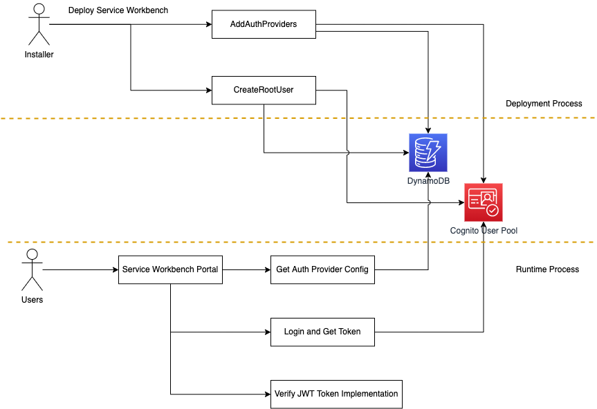
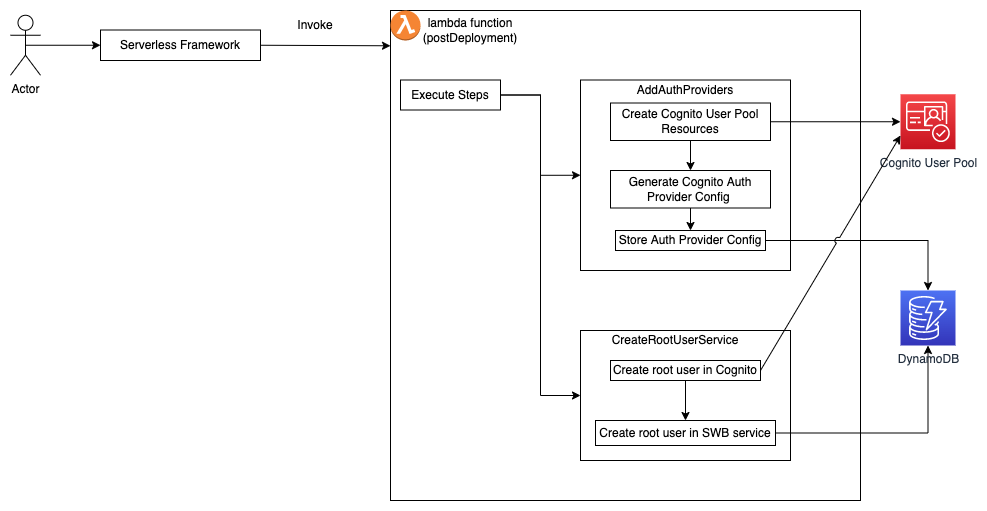
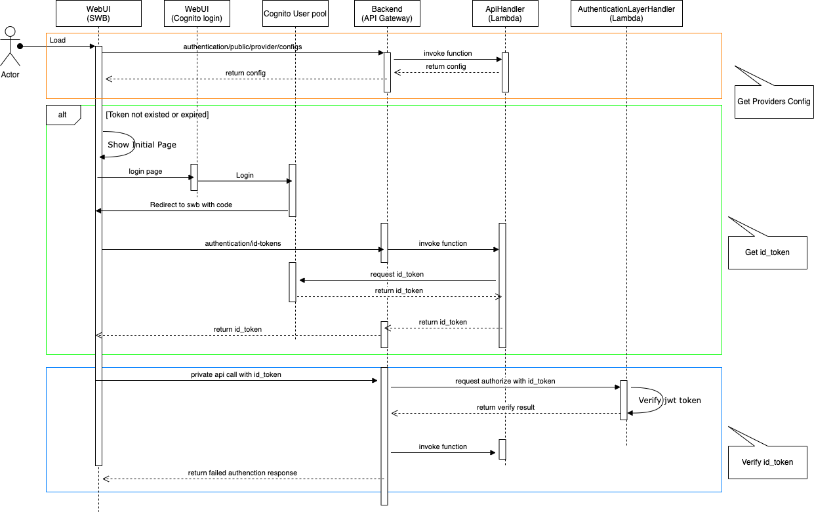
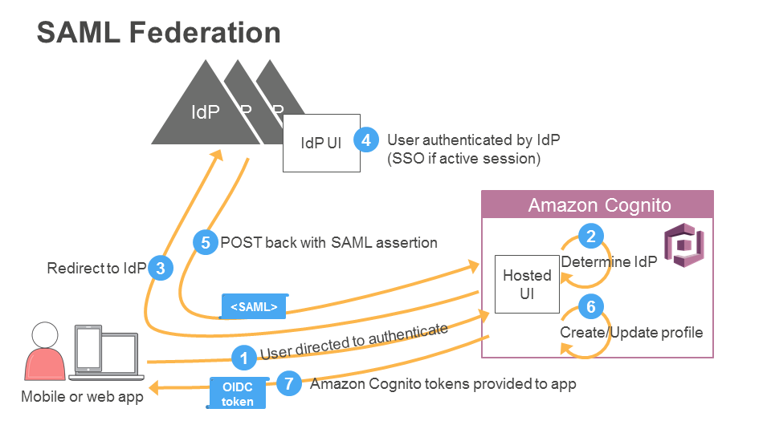
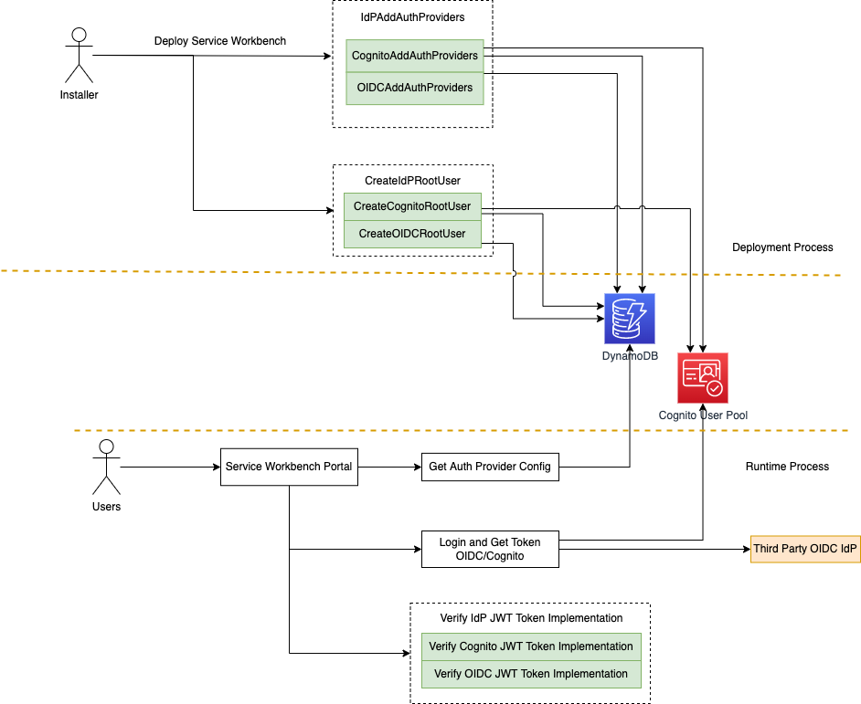
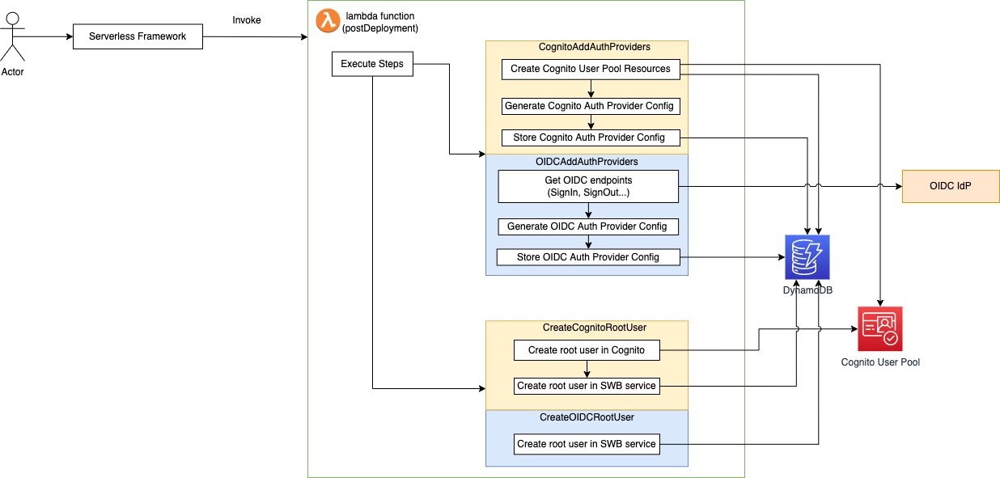
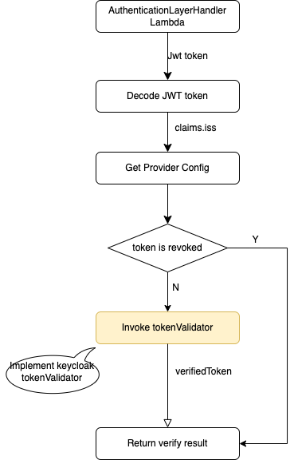

# Summary
This RFC proposes is to make the Service Workbench can support third party OIDC IdPs besides Cognito User Pool, such as KeyCloak, Okta, Authing and etc.

# Motivation
Service Workbench is an open-source web application that provides a self-service and push-button provisioning experience of ready-to-use IT environments for research projects or classroom experiments on AWS. The authentication and authorization are mandatory features. User must be registered and granted before they can use Service Workbench web console. 

## What are we doing today?
The current situation is that Service Workbench already includes authentication and authorization features. The Service Workbench use Cognito User Pool as the default IdP to implement authentication feature. The Service Workbench also support users to use other IdPs as federated IdP through Cognito User Pool. 
The authorization feature is implemented by Service Workbench internal logic, the user's permission is managed in Service Workbench DynamoDB.

For authentication feature, either we use Cognito User Pool as IdP or use other IdPs as federated IdPs, we have to use Cognito User Pool.
This implementation causes two issues:
1. Cognito user pool become a blocking issue of deploying Service Workbench in the regions without Cognito User Pool.
2. Users will concern that they have to use Cognito User Pool. Some users would like to use other OIDC IdPs directly, such as Keycloak, Okta, Authing and etc.

## What are we proposing to do?
This RFC proposes to release the Service Workben to support third party OIDC IdPs for authentication in Service Workbench, Users can set different configurations to deploy Service Workbench to integrate with third party OIDC IdP.

After releasing, the Service Workbench should:
1. Support users to deploy and use Service Workbench solution in the regions without Cognito User Pool.
2. Support the case that the users don't want to use Cognito User Pool, but want to use Keycloak, Okta, Authing or other OIDC IdPs.

# Current authentication implementation via Cognito User Pool

## High level design for Cognito User Pool authentication



According to this diagram, we can know that authentication related two parts: deployment process and runtime process.

## Deployment process
During Service Workbench deployment, the authentication related resources will be created in lambda function(postDeployment), such as creating Cognito User Pool, generating **Auth Provider Config** and saving it into  DynamoDB, create root user and so on.



### AddAuthProviders
AddAuthProviders class is responsible for creating cognito related resources and generate **Auth Provider Config** and save it into  DynamoDB. If there are federated IdP configs, AddAuthProviders is also responsible for creating "Identity providers" in Cognito User Pool, and save federated IdP config into DynamoDB.

**Cognito related resources includes:**
  - Cognito User Pool
  - User Pool Client
  - User Pool Domain
  - Identity Provider
  - Attribute Mapping

The **Auth Provider Config** is the key configuration for each IdP, and it is used by both the client-side and back-end, mainly contains the following three parts:
  - Cognito configurations:
    Service Workbench integrates with Cognito User Pool to signin, signout and get id_token through these configurations.
    ```
    {
      ...
      "id":
      "signInUri": 
      "signOutUri": 
      "authCodeTokenExchangeUri":
      ...
    }
    ```

  - Implementation configurations
    Server-side get implementation of validator according to these configurations:
  ```
  {
    ...
    "impl": {
      ...
      "tokenValidatorLocator": "locator:service:cognitoUserPoolAuthenticationProviderService/validateToken",
      "tokenRevokerLocator": "locator:service:cognitoUserPoolAuthenticationProviderService/revokeToken"
      ...
    }
    ...
  }
  ```

### CreateRootUserService:
CreateRootUserService is responsible for creating root user into Service Workbench DynamoDB for authorization feature and creating user into Cognito User Pool for authentication. The root user is for the user to access Service Workbench at first time.
Default root user configs are in main/config/settings/.defaults.yml file, there are default values if user do not override them.

```
rootUserFirstName: root
rootUserLastName: root
rootUserEmail: root@example.com
```
If user want to override above configurations, user can add above configurations into "main/config/settings/${STAGE_NAME}.yml" file.  

## Runtime process:
User can choose Cognito User Pool to authenticate user directly or choose federated IDP to authenticate user. 
Below is the sequence diagram for using Cognito User Pool directly:



There are three parts related to authentication:
- Get **Providers Config**. The **Providers Config** contains "signInUri", "signOutUri", IDP title and so on. Through these information, web app shows IDP options to users and integrates with IDPs. Example as below:
```
[
  {
    ...
    "title": "Cognito Native Pool",
    "type": "cognito_user_pool",
    "credentialHandlingType": "redirect",
    "signInUri":
    "signOutUri": 
    "enableNativeUserPoolUsers": true
    ...
  }
]
```

- Get id_token. 
The Service Workbench use **response_type=code** way to integrate with Cognito User Pool, browser redirect to Cognito User Pool login page according to above **Providers Config**. After user input correct username and password, browser redirect user back to Service Workbench page, then request id_token from Service Workbench server-side lambda function(ApiHandler). The lambda function(ApiHandler) send request withing **code** to Cognito user Pool server for id_token.

- Verify id_token.
API Gateway handles all private request and verify if the token is valid through the lambda function(AuthenticationLayerHandler). The lambda function(AuthenticationLayerHandler) get "tokenValidatorLocator" from "Auth Provider Config", then invoke validateToken method to verify input token.

If user choose federated IdPs to authenticate user, the main sequence is similar with Cognito User Pool, there is only a little different for user logining and getting id_token. The callflow like below:



The user is also redirected to Cognito User Pool Server, but the URL contains **idp_identifier=idpId", Cognito User Pool will go on redirecting to federated IdP.

# Design Summary
The general approach proposed by this RFC is supporting other third-party OIDC IdPs for authentication beside Cognito User Pool. Users can set different configurations to deploy Service Workbench to integrate with third party OIDC IdP.

## High level design.
The proposal of high level design as below:



We will refactor green parts: **AddAuthProviders**, **CreateRootUser** and **implementation of JWT token verification**, make these parts support third-party OIDC IdPs based on configuration. These three parts are implemented according to the OIDC standard, so in theory all OIDC IdPs should be supported, just need to change some configurations. If the IdP has some special implementations, we needs to handle it according to the specific cases.

## Detail Design
The design will be divided into two parts: Deployment Process and Runtime Process.

### Deployment Process design
We keep the current highlevel design that invoking lambda function(postDeployment) to create the resources related with the authentication feature. But which resources are created is determined by configuration as below in "main/config/settings/\${STAGE_NAME}.yml" file, we will also add the default value into main/config/settings/.defaults.yml file, this default value will be used if the field in ${STAGE_NAME}.yml file is missing:
```
defaultIDPType: oidc/cognito
```
If user choose "oidc", because oidc IdP resources cannot be created by Service Workbench deployment process, there are some prerequisites that user need to do:
1. User should have a deployed oidc IdP.
2. Create an application or client in this IdP for Service Workbench or use existed one.
4. Create an root user in this IdP.



#### AddAuthProviders
We will have different implementation of **AddAuthProviders** for OIDC and cognito.
- OIDCAddAuthProviders
- CognitoAddAuthProviders

Load and run OIDC or cognito implementation based on defaultIDPType config. Code as below in addons/addon-base-post-deployment/packages/base-post-deployment/lib/plugins/steps-plugin.js file:
```
    const defaultIDPType = this.settings.get(settingKeys.defaultIDPType);
    switch (defaultIDPType) {
      case 'oidc':
        stepsMap.set('addAuthProviders', new OidcAddAuthProviders());
        break;
      case 'Cognito':
        stepsMap.set('addAuthProviders', new CognitoAddAuthProviders());
        break;
      default:
        console.log(`Sorry, we are out of ${defaultIDPType}.`);
    }
```

In the "OidcAddAuthProviders" class, it need to add generate oidc **Auth Provider Config** and save it into DDB. We will add following configurations options in "main/config/settings/${STAGE_NAME}.yml" file for OIDC information.
```
oidcIssuer: xxx
oidcClientId: xxx
```

The oidc **Auth Provider Config** should be similar to the CognitoAuthProviderConfig, also contains the following three parts:
  - OIDC IdP information:
  Service Workbench integrate with OIDC IdP to login, login and get id_token through these configurations.
```
{
  ...
  "clientId": 
  "signInUri": 
  "signOutUri": 
  "authCodeTokenExchangeUri":
  ...
}
```

- Implementation configurations:
Server-side get implementation of validator according to these configurations:
```
{
  ...
  "impl": {
    ...
    "tokenValidatorLocator": "locator:service:oidcAuthenticationProviderService/validateToken",
    "tokenRevokerLocator": "locator:service:oidcAuthenticationProviderService/revokeToken"
    ...
  }
  ...
}
```

### CreateRootUser
We will have different implementation of **CreateRootUser** for OIDC and cognito.
- CreateOIDCRootUser
- CreateCognitoRootUser

Load and run oidc or cognito implementation based on defaultIDPType config. Code as below in addons/addon-base-post-deployment/packages/base-post-deployment/lib/plugins/steps-plugin.js file:

```
    const defaultIDPType = this.settings.get(settingKeys.defaultIDPType);
    switch (defaultIDPType) {
      case 'oidc':
        stepsMap.set('addAuthProviders', new CreateOIDCRootUser());
        break;
      case 'Cognito':
        stepsMap.set('addAuthProviders', new CreateCognitoRootUser());
        break;
      default:
        console.log(`Sorry, we are out of ${defaultIDPType}.`);
    }
``` 

The difference between CreateOIDCRootUser and CreateCognitoRootUser class, CreateOIDCRootUser class does not need to create user in OIDC IdP, just need to create root user in Service Workbench DynamoDB, the user in OIDC IdP should be created before deploying Service Workbench. The root user information in Service Workbench DDb should be consistent with user in OIDC.

If we create root user in OIDC is not consistent with below default root user configs in main/config/settings/.defaults.yml file:
```
rootUserFirstName: root
rootUserLastName: root
rootUserEmail: root@example.com
```

We can add following configurations options in "main/config/settings/${STAGE_NAME}.yml" file to override above default values.

```
rootUserEmail: xxx
rootUserFirstName: xxx
rootUserLastName: xxx
```

### Runtime process design.
According to our analysis, there are three parts related to authentication: 
- Get **Providers Config**.
- Get id_token.
- Verify id_token.

#### "Get **Providers Config**"
We think that it is not related with which IdP be used, so this part does not need to be refactored. 

#### "Get id_token"

Use the same way of cognito to get id_token
Whatever OIDC IdP and Cognito User Pool, we use OpenId-connect to integrate with them. So we can use the same way to get id_token from Idp(OIDC or Cognito User Pool). The value of different parameters can be from **Providers Config** which is generated and saved into DynamoDB during the Service Workbench deployment. So we can keep current implementation, just need to change some hardcode of Cognito User Pool.

#### Verify id_token

The verification of token is handled by AuthenticationLayerHandler Lambda function, the main logic of AuthenticationLayerHandler Lambda function is as follows:



The code logic of id_token validation is depended on Cognito or OIDC IdP are using, so we need implementation to verify id_token for OIDC IdP. In the **Auth Provider Config** which creating during Service Workbench deployment, we have configured "tokenValidatorLocator", AuthenticationLayerHandler Lambda function can get the implementation of validator to validate id_token through "tokenValidatorLocator" configuration. For implementation, we will create a new class for OIDC: **OIDCAuthenticationProviderService**
##### OIDCAuthenticationProviderService
We will implement OIDCAuthenticationProviderService for OIDC, the "validateToekn" and "revokeToken" method will be used to validate id_token or revoke id_token. The "revokeToken" is the similar with Cognito User Pool, just need to mark this token as a revoked token when the user is logout , during the token validation process, if the token is already marked as revoked, the token will be validated as a an invalid token.
For token validation, the implementation is different between OIDC and cognito, so we need a seperated implementation.
Below is the code snippets OIDC token validator:
```
const _ = require('lodash');
const jwt = require('jsonwebtoken');
const jwksClient = require('jwks-rsa');

async function getOIDCTokenVerifier(jwksUri) {

  const keyClient = jwksClient({
    cache: true,
    cacheMaxAge: 86400000, //value in ms
    rateLimit: true,
    jwksRequestsPerMinute: 10,
    strictSsl: true,
    jwksUri: jwksUri
  })
  
  const verificationOptions = {
    "algorithms": "RS256"
  }

  function getSigningKey (header = decoded.header, callback) {
    keyClient.getSigningKey(header.kid, function(err, key) {
      const signingKey = key.publicKey || key.rsaPublicKey;
      callback(null, signingKey);
    })
  }  

  const verify = async token => {
    // First attempt to decode token before attempting to verify the signature
    let decoded_output;
    var promise = new Promise(function(resolve, reject) {
      jwt.verify(token, getSigningKey, verificationOptions, function (error, decoded) {
        if (error) {
          resolve(error);
        } else {
          resolve(decoded);
        }
      });
    });
    await promise.then(function(data) {
      decoded_output = data;
    });
    return decoded_output;
  };
  return { verify };
}

module.exports = { getOIDCTokenVerifier };
```

Beside the changes mentioned above, there are some hardcode places in the existing implementation for Cognito User Pool that also need to be refactored, which will not be listed in this RFC.

# Summary
With this refactoring, user can choose to use third party OIDC IdP or Cognito User Pool by configuration, and if user need to support other IdPs, we only need to set issuer and client id, swb can integrate with these OIDC IdPs.

# Remaining Work

- [ ] Review this RFC 
- [ ] Coding.
- [ ] Pull request of implementation.


# Future Possibilities

- After this is released we should consider if we need to integrate with other IDPs.

[cognito-user-pool]: https://docs.aws.amazon.com/cognito/latest/developerguide/cognito-user-identity-pools.html