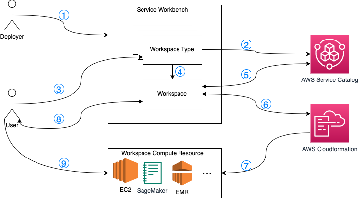
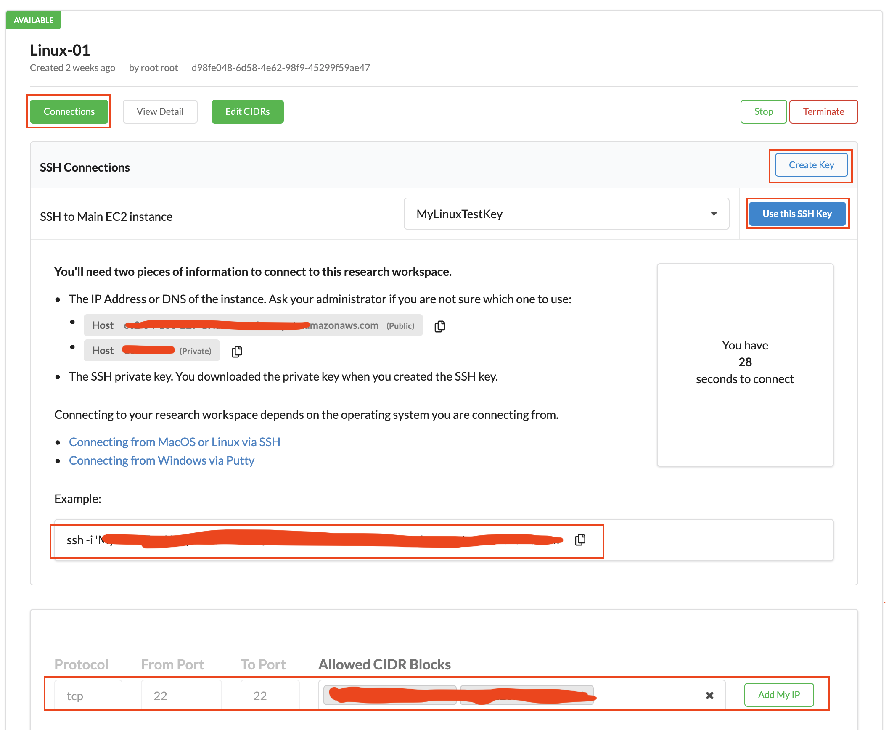
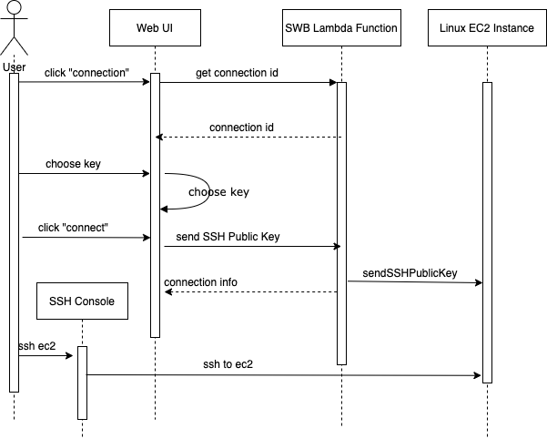
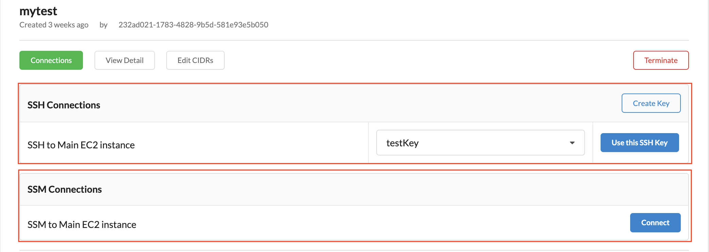
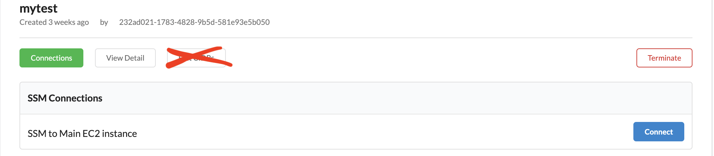
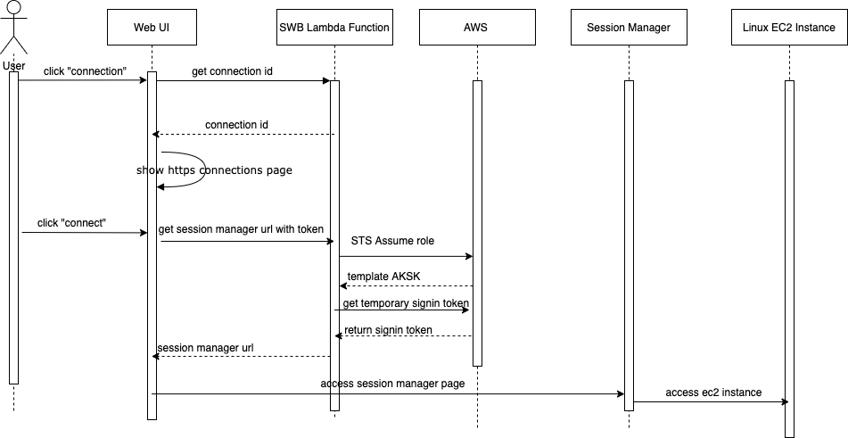

# Summary
This RFC proposes is to make the Service Workbench can support user to access workspace instance through AWS System Manager Session Manager.


# Motivation
Service Workbench is an open-source web application that provides a self-service and push-button provisioning experience of ready-to-use IT environments for research projects or classroom experiments on AWS. Currently, Service Workbench has five build-in workspace types（SageMaker, Windows, Linux, EMR and Rstudio), and Service Workbench provide following methods to access these workspaces instances: "Https", "SSH" and "RDP(remote desktop protocol)".

## What are we doing today?
The current situation is that Service Workbench enable user to access linux workspace instance through SSH. The detail workflow is as below:
1. User accesss Service Workbench.
2. User creates a linux workspace. After this process, the linux ec2 instance will be launched.
3. User creates a key pair through Service Workbench. User needs to download private key to local.
4. User chooses a key pair which is created in above step, then click "Connect" button, the Service Workbench will send the public key to EC2 Linux instance.
5. User uses this key pair's private key to ssh into EC2 Linux instance.

This implementation needs user to store the private key in local and Service Workbench levearge [ec2-instance-connect][ec2-instance-connect] feature to send the ssh public key to ec2 instance. This implementation will cause following issues:
1. Because ec2-instance-connect feature is not enable in cn-north-1, cn-northwest-1 and ap-east-1 regions. This causes Linux workspace is not workable in these regions.
2. Once private key is lost, There is a potential risk.
3. If the user enters an arbitrarily large CIDR (such as 0.0.0.0/0), the security of the instance can potentially be compromised.

## What are we proposing to do?
This RFC proposes to release the Service Workben to support AWS System Manager Session Manager to access linux ec2 instance.
After releasing, the Service Workbench should:
1. Support users to access linux ec2 instance through AWS System Manager Session Manager.
2. Make linux workspace can be used the regions which does not support [ec2-instance-connect][ec2-instance-connect] feature.
3. User can choose Session Manager or SSH to access linux ec2 instance in the regions where the [ec2-instance-connect][ec2-instance-connect] is supported.

# Current implementation of linux EC2 instance connection

## Workflow of Creating and Using Workspace
Below is main workflow related with workspace:


1. Deployer deploys Service Workbench.
2. During the deploying process, Service Workbench creates workspace types and also creates aws service catalog products to associate with workspace types
3. User chooses a workspace type to create workspace.
4. Service Workbench starts create workspace from a workspace type.
5. Service Workbench get an assoicated aws service catalog product.
6. Service Workbench use aws service catalog product tempalte to create a cloudformation stack, and listen cloudformation stack status and get output from cloudformation stack, then store this workspace information into Service Workbench DynamoDB.
7. Cloudformation stack create all resources declared in workspace template.
8. User request to connect workspace, user will get the connections information including connection methods, such as "Https", "SSH" and "RDP(remote desktop protocol)".
9. User access workspace resource through the information from above step.

The step 1 to 5 are not related with connection method.
The step 6, Service workbench will get output of cloudformation stack which contains the information of connection method, like below:
For SSH connection:
```
  MetaConnection1Scheme:
    Description: Protocol for connection
    Value: ssh
```
For Https connection:
```
  MetaConnectionScheme:
    Description: Protocol for connection 1
    Value: https
```    

For RDP connection:
```
  MetaConnection1Scheme:
    Description: Protocol for connection
    Value: rdp
```

The step 8 and step 9 are the main logic that user connect workspace resources. Following section will show more detail.

## Design of linux EC2 instance connection
### UI experience of linux ec2 instance connection
Let's know about current user experience of linux ec2 instance connection at first:


1. User clicks "Connections" button, Web UI will show "Create Key" and "Use this SSH Key" if there is existing SSH Key.
2. User choose a SSH Key, this SSH public key will be sent to EC2 instance, at the same time, UI will show the information to guide user how to access ec2 instance.
3. User can set CIDRs to limit user to access EC2 instance.

### Linux Workspace Connections Connection Sequence
Current sequence of linux ec2 instance connection:


1. User click "Connections" button, client side will send request to server side to get instanceId, connectionId and connection method. Web UI will render the page to match with connection method. In this case, the connection method is "ssh", Web UI will show the page of "ssh" to user according to "ssh" connection method.
2. User choose a key which should be created by user before
3. User click "connect", client side send request to backend to send public key to ec2 instance, then return all connection to client side, suce as "publicDnsName".
4. Web UI will show the information to guide user how to access ec2 instance.
5. User ssh to ec2 instance.

# Design Summary
The general approach proposed by this RFC is replacing ssh connection with AWS System Manager Session Manager. User can access ec2 instance through Session Manager, do not need to store and maintain ssh private key.

## Web UI experience.
Below is the experience after refactoring. 
In the regions where the [ec2-instance-connect][ec2-instance-connect] is supported. User can choose SSM connection or SSH connection, like below web UI:


For the region where the [ec2-instance-connect][ec2-instance-connect] is not supported, User can only connection to ec2 instance through SSM, like below web UI:


### For SSH connection, we keep current user experience.

### For SSM Connection, the user experience is as below:
1. User click "Connections" button, Web UI will show "Connect" button to user.
2. User click "Connect" button, user will be redirect to AWS Session Manager page, and user can use ec2 instance directly in this page.
3. There is not "Edit CIDRs" button, because we use swb permission to control which user can access to ec2.

#### Steps of connecting to EC2 Linux via Session Manager
1. Click the connections button shown in EC2 Linux instance
2. Choose `SSM Connections`, click `Connect` to access EC2 Linux as `ssm-user` user.
3. Run `sudo su ec2-user` to change to `ec2-user` user.
4. The selected studies will show up as mounted directories on the EC2 Linux instance `/home/ec2-user` folder. These study directories will contain files uploaded to the corresponding study. Any files uploaded to the study from the Service Workbench will automatically appear in the mounted study directories after a short delay.


## Detail Design.
For implementing above user experience, there are three parts need to change:

### Linux workspace template
We need to refactor ``service-workbench-on-aws-cn/addons/addon-base-raas/packages/base-raas-cfn-templates/src/templates/service-catalog/ec2-linux-instance.cfn.yml`` template to support ``Ssm`` connection method. 

1. As mentioned in previous section, connection method is configured in cloudformation tempalte output value, we need to add below code snap into linux template:

ssm connection:
```
  MetaConnection2Scheme:
    Description: Protocol for connection 2
    Value: ssm
``` 
2. Create a role(EC2SSMRole) which can start Session Manager and grant Service Workbench role to assume this ``EC2SSMRole``, the code snap is like below:
```
  EC2SSMRole:
    Type: 'AWS::IAM::Role'
    Properties:
      RoleName: !Join ['-', [Ref: Namespace, 'ec2-ssm-role']]
      Path: '/'
      AssumeRolePolicyDocument:
        Version: '2012-10-17'
        Statement:
          - Effect: 'Allow'
            Principal:
              AWS:
                - !Ref ApiHandlerArn
            Action:
              - 'sts:AssumeRole'
      Policies:
        - PolicyName: !Join ['-', [Ref: Namespace, 'ssm-session-policy']]
          PolicyDocument:
            Version: '2012-10-17'
            Statement:
              - Effect: 'Allow'
                Action: 'ssm:StartSession'
                Resource: !Join 
                  - ''
                  - - 'arn:'
                    - !Ref AWS::Partition
                    - ':ec2:'
                    - !Ref AWS::Region
                    - ':'
                    - !Ref AWS::AccountId
                    - ':instance/'
                    - !Ref EC2Instance

```

We also need to output this role arn through CloudFormation Output as below:
```
  WorkspaceSSMRoleArn:
    Description: IAM role assumed by API Handler to start session
    Value: !GetAtt EC2SSMRole.Arn
```

### Workspace Connection Sequence
We need to add new logic for linux session manager connection, the sequence of connection process is as below:


### Get Connections
After user clicking "Connection" green button, client side will send ```/api/workspaces/service-catalog/${envId}/connections``` request to server side. Server side will return below content to client side:
```
[
  {
    "instanceId": "xxx",
    "id": "id-2",
    "name": "SSM to Main EC2 instance",
    "scheme": "ssm",
    "operation": "list"
  }
]
```
The response is depended on the cloudformation template output that mentioned in previous section, the logic of ``Get Connections`` is not needed to change.

The front-end web page will handle response of ``Get Connections``, and show different connection page according to ``scheme`` in response. For ssm scheme, we will add new connection page ``ScEnvironmentSsmConnections.js`` to handle ssm scheme.


### Get Detail Information to Connect
After user clicking "Connect" blue button, client side will send ``/api/workspaces/service-catalog/${envId}/connections/${connectionId}/ssm-url`` request to server side to get session manager url with siginToken. This request is just for SSM, the server side will have new logic to handle this request. The process of this new logic will have implementation as below:
* Assume role to get temporary AK/SK
* Get temporary signin token
* Generate session manager url with signin token

1. Assume role:
The ``getCredentialsForRole()`` method is existing in current source code in addons/addon-base/packages/services/lib/aws/aws-service.js file. We can reuse it to get ``EC2SSMRole``'s AK/SK, it will be used for getting signIn token.


2. Get temporary signin token
We can get signIn token through the AK/SK, the code snap is like below:
```
  const session = {'sessionId': accessKeyId, 'sessionKey': secretAccessKey 'sessionToken': sessionToken};

  let sessionDuration = 3600; //default session duration, 1 hour
  if (Number(SessionDuration) > 0) {
    sessionDuration = Number(SessionDuration);
  }
  const getSigninTokenParams={
    'Action': 'getSigninToken',
    'SessionDuration': sessionDuration,
    'Session': session};     

    const getSigninTokenURL = `https://${region}.signin.${consoleDomainSuffix}/federation`;

    const response = await axios.get(getSigninTokenURL, {getSigninTokenParams});

    const signinToken = response.data.SigninToken;
```  

The sessionDuration can be configured in workspace template input parameter and send to service workbench server side through cloudformation stack output.
The template should be like below:

```
Parameters:
  ...
  SessionDuration:
    Type: String
    Description: Duration of ec2 connection session
  ...
```

```
Outputs:
  ...
  SessionDuration:
    Description: Duration of ec2 connection session
    Value: !Ref EC2Instance
```

3. Generate Session Manager URL
After getting signIn token, we will create session manager url with signIn token and return to client side. User can use this url to access session manager directly.
Code snap is like below:
```
const ssmConsoleUrl = `https://${region}.signin.${consoleDomainSuffix}/federation?Action=login&Issuer=Instruqt&Destination=https://${region}.console.${consoleDomainSuffix}/systems-manager/session-manager/${instanceId}?region=${region}&SigninToken=${signinToken}`;

```

### Redirect to Session Manager page
Current code already implement the logic of redirecting to the new page with URL from Service Workbench server side. So we can reuse it, and do not need any change.


# Summary
With this refactoring, user can access linux template through Session Manager, does not need to store and maintain private key. And make Service Workbench linux workspace workable in all regions which do not support ec2-instance-connect feature.


# Future Possibilities

[ec2-instance-connect]: https://docs.aws.amazon.com/AWSEC2/latest/UserGuide/ec2-instance-connect-methods.html